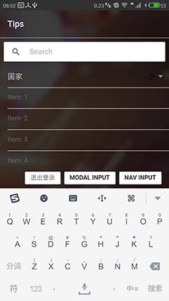
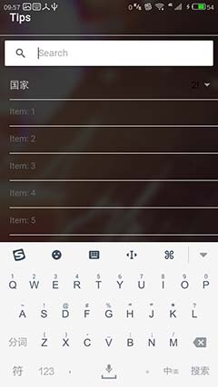

[TOC]

# Angular 基础

## 子模块与共享模块

此处的“模块”指的是使用 `@NgModule` 装饰器的类。在项目开始时，一般只有一个模块，也就是根模块（ `/src/app/app.module.ts` ）。在模块中，可以声明所要使用的页面、组件、服务、指令、管道、引入插件、启动项目等。所有自定义的页面、组件、服务、指令、管道，在创建之后都必须到模块中进行声明，否则将无法使用。

但是随着项目的增大，根模块的内容也会不断增加，代码变得庞大也不直观，此时可以考虑启用子模块与共享模块。

以 `/src/pages/information/information.module.ts` 为例，此代码的 `InformationModule` 类也使用了 `@NgModule` 装饰器，然后对本模块所用的各种类进行了声明，并将可能会被其他模块引用的组件进行了导出（ `exports` ）。此外还要注意，在此模块中使用 `IonicPageModule.forChild(InformationPage)` 导入了 `InformationPage` ，这与根模块有区别：根模块使用的是 `IonicModule.forRoot(GjsApp)` ， `forRoot()` 方法只能在根模块上使用，而其他模块只能使用 `forChild()` 方法。

在根模块上，使用 `imports: [InformationModule]` 导入了前面定义的子模块 `InformationModule` ，这样根模块下的所有成员都可以使用 `InformationModule` 子模块使用 `exports` 导出的 `InformationPage` 。

共享模块类似于子模块，主要区别是其中不包含 Ionic 页面。可以参见 `/shared` 文件夹下的各个代码文件，例如 `/src/shared/list-shared.module.ts` ，此共享模块主要是声明并导出了各个管道操作，简化了根模块的代码。

## 服务与单例

在模块的声明中，使用 `providers` 声明的类可以称为“服务”（ provider 或 service ）。服务的特征是在模块内是单例的，一个模块所声明的服务，在其组件内所获得的该服务的实例，都是同一个实例，因此可以用来存储共享数据、公共处理方法等。

模块可以嵌套，如果在根模块内嵌入了其他模块，并且子模块对同一个服务也使用 `providers` 进行了声明，则根模块与子模块的同一服务的实例将是不同的实例。一个服务若在多个模块内被声明，则每个模块都会分别获得该服务的不同实例。

## 依赖注入

依赖注入主要是用于解决类的初始化与解耦的问题。

在传统的模式中，如果一个类中使用了其他类的实例，则在初始化目标类的实例时，必须按照目标类的构造函数所规定的参数传入相应的数据。这样一来是每个类都必须知道所使用的其他类需要哪些初始化参数，另一方面当目标类被改写时，使用这些类的类也必须改写初始化调用的代码。这样不同的类之间就出现了强耦合的情况，不利于项目编写与维护。

Angular 使用依赖注入来解决此问题。在类的声明上可以添加装饰器，最基础的是 `@Injectable` 装饰器。带有该装饰器的类，若构造器函数的参数使用了其他类的实例，或者本类的某些属性是其他类的实例，则 Angular 引擎会自动判断需要为其他类的构造器传入哪些参数，当前类在声明其他类的实例时，只要声明类型即可，完全不需要知道目标类的初始化参数。例如：

```ts
@Injectable()
export class ImagePickerService {

    constructor(
        private imagePicker: ImagePicker,
        private androidPermissions: AndroidPermissions,
        private platform: Platform,
    ) {

    }

}
```

Angular 用于修饰类的其他任意装饰器（例如 `@Component` 、 `@Directive` 等），实际上都带有依赖注入的特性。

### @Inject 装饰器

前面提到的依赖注入，使用的是以类声明为目标的装饰器。而还有另外一种方式，可以用在函数参数上，也就是 `@Inject` 装饰器。例如：

```ts
constructor(
  @Inject('appSettings') public appSettings,
) {

}
```

在 `@Inject` 装饰器的参数内使用字符串代表需要注入的类。注意：使用这种方式时，需要先在模块的 `providers` 声明上做相应的定义，例如：

```ts
@NgModule({
  providers: [
    {provide: 'appSettings', useClass: AppSettings},
  ]
})
export class AppModule {}
```

使用 `@Inject` 装饰器从表面上看来可以在进行注入时不书写类型（ `@Inject('appSettings') public appSettings` ），因此在相关页面也不需要进行导入（ `import { AppSettings } from '../../providers/app-settings';`），似乎比较方便。但实践后发现这并不是一种好的代码书写方式。原因是在声明 `appSettings` 属性时，并没有声明其类型，类型默认为 `any` ，这样代码提示与属性、方法检查等等特性都无法使用了。若使用 `@Inject` 装饰器同时还对属性进行类型声明，则 `@Inject` 节约代码的优势就没有了。

**因此在实践后放弃了 `@Inject` 装饰器，并且也不建议再使用它。**

### 循环依赖

使用依赖注入时，需要注意循环依赖的问题。例如 A 类依赖了 B 类，而 B 类也依赖了 A ；或者 A 依赖 B ， B 依赖 C ， C 依赖 A ；诸如此类。依赖注入时若出现循环依赖，则在注入时将会报错（运行时错误）。

出现循环依赖时，一般代表项目的结构设计出现了问题，需要修正。一般的解决方式是：

1. 将公共的部分提取到一个类中，其他涉及到的类都依赖此公共类即可；
1. 使用 Promise 、 Observable 等，在一个类中将状态的变化暴露出来；而其他类订阅该暴露出的状态/属性，绑定本类中相应的处理函数，在目标状态变化时触发处理函数，实现类之间的解耦。

## 指令

Angular 的指令主要分为属性型指令与结构指令。

属性型指令主要是对元素的样式进行修改，也可以监听元素上的事件。结构性指令可以改变 html 文档的结构。

>**每个 html 元素上最多只能使用一个结构性指令。**

可以使用 `@Input` 装饰器为指令输入参数。默认情况下，输入参数的名称与指令名称相同，但也可以进行改名。可以为一个指令输入多个参数。简单的例子可参考 `/src/directives/liked/liked.ts` ：

```ts
import { Directive, ElementRef, Input } from '@angular/core';

@Directive({
  selector: '[liked]'
})
export class LikedDirective {
  
  constructor(private el: ElementRef) { }

  @Input('liked')
  set redFont(value) {
    const color = value ? "#ea3333" : "#fff";
    this.el.nativeElement.style.color = color;
    this.el.nativeElement.getElementsByClassName('thumb')[0].style.backgroundColor = color;
  }
}
```

使用范例：

```html
<div [liked]="isLiked(commentItem)">
	<!-- 内容 -->
</div>
```

结构型指令可以利用 TemplateRef 与 ViewContainerRef 调用局部模板与容器，进行自定义的渲染。参考下面的例子。

### 利用指令传递数据

参考以下模板：

```html
<ion-row *ngFor="let data of listData; trackBy: (data?.baseData | async)?.stockCode;"
     class="bottom-hr light-transparent"
     [class.dark-transparent]="isOption"
     tappable [navPush]="stockDetailPage" [navParams]="(data?.baseData | async)?.stockCode"
>
  <ion-col padding>
    <div class="col1">
      <h5>{{(data?.baseData | async)?.name || '----'}}</h5>
      <div *ngIf="isOption">
        <span class="font-smaller">持仓</span>
        <span class="color-important">{{data?.personalData?.restQuantity}}</span>
      </div>
      <span *ngIf="!isOption">{{(data?.baseData | async)?.stockCode}}</span>
      <h6 *ngIf="showDetail">总市价：{{(data?.baseData | async)?.marketInfo?.marketValue}}</h6>
    </div>
  </ion-col>
  <ion-col padding>
    <div class="col2">
      <h4 class="{{(data?.baseData | async)?.changeRate | riseOrFall}}" [class.showDetail]="showDetail">{{(data?.baseData | async)?.latestPrice | number:'.2-2'}}</h4>
      <h6 *ngIf="showDetail">换手率：{{(data?.baseData | async)?.marketInfo?.turnoverRate | percent:'.2-2'}}</h6>
    </div>
  </ion-col>
  <!-- 其他内容…… -->
</ion-row>
```

在此模板中，可以看到 `(data?.baseData | async)` 表达式被重复书写了多次，相当繁琐。能不能进行一次数据传递，简化模板呢？

尝试使用结构型指令来解决这个需求。

1. 创建一个指令：

	```ts
	// '/src/directives/tri-row/tri-row.ts'
	import { Directive, Input, TemplateRef, ViewContainerRef } from '@angular/core';

	@Directive({
	  selector: '[triRow]'
	})
	export class TriRowDirective {
	  
	  constructor(
	    private templateRef: TemplateRef<any>,
	    private viewContainer: ViewContainerRef,
	  ) {

	  }

	  @Input('triRow')
	  set triRowData(value) {
	    if (value){
	      const view = this.viewContainer.get(0) as EmbeddedViewRef<any> ||
	        this.viewContainer.createEmbeddedView(this.templateRef)
	      view.context.$implicit = value
	    }
	  }
	}
	```

1. 修改模板页：

	```html
	<ion-grid no-padding text-center class="col-center-center" [class.dark-transparent]="isOption">
	  <div no-padding *ngFor="let data of listData; trackBy: (data?.baseData | async)?.stockCode;">
	  <ion-row *triRow="data?.baseData | async; let subData;"
	       class="bottom-hr light-transparent"
	       [class.dark-transparent]="isOption"
	       tappable [navPush]="stockDetailPage" [navParams]="subData?.stockCode"
	  >
	    <ion-col padding>
	      <div class="col1">
	        <h5>{{subData?.name || '----'}}</h5>
	        <div *ngIf="isOption">
	          <span class="font-smaller">持仓</span>
	          <span class="color-important">{{data?.personalData?.restQuantity}}</span>
	        </div>
	        <span *ngIf="!isOption">{{subData?.stockCode}}</span>
	        <h6 *ngIf="showDetail">总市价：{{subData?.marketInfo?.marketValue}}</h6>
	      </div>
	    </ion-col>
	    <ion-col padding>
	      <div class="col2">
	        <h4 class="{{subData?.changeRate | riseOrFall}}" [class.showDetail]="showDetail">{{subData?.latestPrice | number:'.2-2'}}</h4>
	        <h6 *ngIf="showDetail">换手率：{{subData?.marketInfo?.turnoverRate | percent:'.2-2'}}</h6>
	      </div>
	    </ion-col>
	    <!-- 其他内容…… -->
	  </ion-row>
	  </div>
	</ion-grid> 
	```

1. 修改相应的 module 代码文件，添加对于 TriRowDirective 的引用与导出。

1. 修改说明：

	* 使用指令的 `triRow` 输入属性（与指令同名）来传入数据，属性重命名为 `triRowData` 。
	* 在输入值改变时，获取对于局部嵌入视图的引用（ EmbeddedViewRef ），若不存在则使用 `viewContainer.createEmbeddedView()` 创建一个新的。
	* **对于所获得的 EmbeddedViewRef 的实例， `view.context.$implicit = value` 手动指定并刷新模板所用的数据（修改模板的上下文，为上下文对象的 `$implicit` 属性指定了特定值）。**
	* 在模板上，多加了一层 `<div>` 元素。因为前面也提到过，一个 html 元素上是不能绑定两个结构型指令的，因此需要增加元素层级。此外，不能破坏 `<ion-row>` 与 `<ion-col>` 的层级关系，避免改变预设样式与行为，因此 `<div>` 元素被添加到 `<ion-row>` 的外层（ `<ion-grid>` 的层级关系则并不太重要）。
	* `<ion-row *triRow="data?.baseData | async; let subData;">` ，此处使用了结构型指令的语法 `*triRow` ，并且使用了微语法 `let` ，将数据对象赋值给一个临时变量 `subData` ，以便在局部模板内使用。

这样修改之后，模板得到了一定程度的简化，渲染效果也符合预期。

>**之前曾经尝试仿造过 `*ngIf` 指令，在数据变化时先使用 `viewContainer.clear()` ，再执行 `viewContainer.createEmbeddedView(this.templateRef, {$implicit: value}) ` 。但试验后发现每次重新渲染时都清除了局部内容并重新创建元素，导致页面上的 DOM 结构被改变，相关的 node 节点每次渲染时都是不同的节点，对页面性能有负面影响。因此后来修改了实现方式，改用 `view.context.$implicit = value` 。**

**作为在模板上给局部模板传递数据的尝试，使用结构型指令可以实现需求，也就是将一个复杂的表达式赋值到一个变量上，以便局部模板可以直接使用这个变量。但是这样的负面效果是可能必须增加一层 html 元素，以应对一个元素上不能使用多个结构型指令的限制。这类需求另一种解决方案是进一步提取、划分子组件，从父组件向子组件传递数据，但同样需要注意增加子组件后的层级关系变化问题。**

此问题可能还有其他的解决方案，有待今后进一步研究。

## 管道与参数

管道用于在 Angular 的 html 模板页上对数据进行处理，例如转换格式、过滤等等。使用时使用管道操作符（竖线， `|` ），也可以添加调用参数，使用冒号 `:` ，多个参数就使用多个冒号。

例如 `/src/pages/account-center/account-center.html` 模板页上就使用了一个带参数的自定义管道 `numMask` ：

```html
<span class="f-right">{{personalDataService.relatedBankAccount.cardNo | numMask:4:4}}</span>
```

该管道的代码为：

```ts
// /src/pipes/num-mask.ts
import { Pipe, PipeTransform } from '@angular/core';

@Pipe({
  name: 'numMask',
})
export class NumMaskPipe implements PipeTransform {
  transform(value: any, left = 3, right = 4) {
      value = value.toString();
      let span = value.length - left - right;
      if(span <= 0 || left < 0 || right < 0){
        return value;
      } else {
        return value.slice(0, left) + '*'.repeat(span) + 
          (right > 0 ? value.slice(-right) : '');
      }
  }
}
```

自定义管道需要实现 `PipeTransform` 接口，在转换函数 `transform()` 中，第一个参数是需要处理的原值，后面的参数则对应于管道在模板上调用时冒号后面的部分。

## 表单

Angular 的表单有几种构建方式，这里只介绍其中两种，未涉及 `FormBuilder` 方式。

1. 直接使用 `<form>` 元素，然后在每个输入项元素上使用 `[(ngModel)]` 双向绑定。例如：

	```html
	<ion-input placeholder="Text Input" [(ngModel)]="searchTitle"></ion-input>
	```

	这里使用双向绑定，将该输入项的实际值与当前类的 `searchTitle` 属性进行了双向绑定。

	输入值的有效性验证、表单提交都自行安排。当然也可以在输入项元素上使用一些预设的有效性限制属性，例如 `required` 、 `min-length` 等等，直接书写为输入项元素的属性。为了屏蔽浏览器的 html5 表单验证，可以在 `<form>` 元素上添加 `novalidate` 属性，即不对整个表单的有效性做验证，而是逐个验证每个输入项。

1. 使用 FormGroup

	前一种方式中，输入项的值（以及所绑定的相关属性）、有效性验证等，都是零散的。而使用 `FormGroup` ，可以将输入项有效整合在一起，有利于统一处理。并且 `FormGroup` 还是可以嵌套的。

	以 `/src/pages/login/login.ts` 为例：

	```ts
	import { Component } from '@angular/core';
	import { FormControl, FormGroup } from '@angular/forms';

	@Component({
	  selector: 'page-login',
	  templateUrl: 'login.html',
	})
	export class LoginPage {
	  loginForm:FormGroup = new FormGroup ({
	    customerId: new FormControl({value: '', disabled: true}),
	    password: new FormControl({value: '', disabled: true}),
	    savePassword: new FormControl({value: false, disabled: true}),
	  });
	}
	```

	相应的模板主要内容为：

	```html
	<form [formGroup]="loginForm" (ngSubmit)="login()" novalidate>
	  <ion-item no-padding no-lines>
	    <ion-input formControlName="customerId" placeholder="客户号" type="number" required></ion-input>
	  </ion-item>
	  <ion-item no-padding no-lines>
	    <ion-input formControlName="password" placeholder="登录密码" type="password" required></ion-input>
	  </ion-item>
	  <!-- 其他代码…… -->
	</form>
	```

	可以看到，在 `<form>` 元素上绑定了一个 `[formGroup]="loginForm"` 属性，对应于 ts 文件中的类属性 `loginForm` 的声明；而在输入项上，使用 `formControlName="customerId"` 的方式绑定了 `loginForm` 的属性，需要注意此处 `formControlName` 是必要的。

	`loginForm` 的每一个属性都是一个 `FormControl` 的实例，此处只简单为每个项设置了初值，并设置 `disabled: true` 让输入项在初始条件下不可激活，在本页面的初始化工作完成之后才会解除 `disabled` 。若创建 `FormControl` 的实例时，只需要赋初值、不用设置 `disabled` 属性，则参数可以不使用对象形式，例如： `customerId: new FormControl('')` 。

	创建 `FormControl` 的实例时，还可以使用验证函数参数以及异步验证参数， `FormControl` 构造器的签名为：

	```ts
	constructor(formState: any, validator?: ValidatorFn|ValidatorFn[]|null, asyncValidator?: AsyncValidatorFn|AsyncValidatorFn[]|null)
	```

	即第二个参数允许是一个验证函数、或验证函数构成的数组，而第三个参数允许是一个异步验证函数或数组。简例：

	```ts
	new FormControl('', Validators.required)
	```

	此处引入了 Validators 对象，使用了它的 required 成员方法。 `required` 之类的有效性限制，可以写在模板页输入项元素的属性上，也可以写在 `FormControl` 的实例创建调用处。

	对表单进行验证时，可以对 `FormGroup` 的元素（属性）进行验证，例如：

	```ts
	login(){
	  const controls = this.loginForm.controls;
	  if (this.loginForm.invalid){
	    for (const field in controls){
	      const fieldControl = controls[field];
	      if (fieldControl.invalid){
	        // 针对输入项存在的问题，给出相应的提示消息
	        return;
	      }
	    }
	  }
	}
	```

	首先检测 `FormGroup` 实例的 `invalid` 属性，若 `invalid` 为 `true` 就表示整个表单验证未通过，接下来对各个项目（ controls ）进行遍历，找到具体的问题。

	此外，针对一些复杂的限制条件，可以在所有项目验证通过之后，再针对个别项目进行额外验证。

## 安全过滤与 DomSanitizer

Angular 的引擎会对页面上的输出内容进行检查或过滤，以避免 XSS （跨站脚本攻击）。当动态渲染内容中包含特殊字符而被判定为可能有危险时，这些动态内容可能会被过滤替换，也可能会导致报错。

在页面上使用 `<div>{{htmlContent}}</div>` 可能会导致 `htmlContent` 的内容被使用 html 实体（ html entity ）进行转义，例如 `<` 会转换为 `&lt;` ，也就是将 `htmlContent` 的内容处理为文本，以规避恶意代码。但有时我们确实需要显示 dom 内容，不期望 html 内容被转换为文本（前提是可以完全确信这些内容中不包含恶意代码），此时可以尝试以下的写法：

```html
<div [innerHTML]="htmlContent"></div>
```

此外，有时候为自定义样式赋值时，由于样式内容中可能包含 `<` 、 `>` 、 `(` 、 `)` 等特殊字符，有可能会导致程序在执行时报错。此时需要使用 `DomSanitizer` 来解决此问题，例如 `/src/modals/camera/camera.ts` ：

```ts
constructor(
  public sanitizer: DomSanitizer,
) {

}

getAllTransform(){
    return this.sanitizer.bypassSecurityTrustStyle(
        `translate(${this.translateX}px, ${this.translateY}px) scale(${this.imageScale})`
    );
}
```

对应的模板为：

```html

```

# Ionic

## 保证 Ionic 控件的层级关系

在登录页与主界面切换动画的问题上，某个旧版本的代码曾经使用过安卓版的纵向滑动效果，原因是当时使用 ios 的横向滑动时，若前往 TabsPage 页面并不会看见动画效果。当时检查发现动画函数确实有执行，但因为相关元素的 `z-index` 属性不正常，导致登录页的界面层被压在下方，动画效果不可见。

但是后来反复尝试，发现问题是来源于 TabsPage 中所使用的一个自定义的菜单控件。这个自定义菜单控件会导致在 `<ion-menu>` 之上多加一层 html 元素，结果影响到了页面元素层级关系，影响了相关样式的应用，也影响了动画效果。只要把 TabsPage 页面上的自定义菜单控件去掉，或者是直接使用官方的 `<ion-menu>` 、不额外进行一层封装，页面滑入滑出的效果就会正常。

观察 Ionic 的预设样式，会发现许多样式上都使用了子元素的选择器（例如 `.ion-row > .ion-col` ）。这样若我们在 Ionic 的预设层级之间插入了自定义的控件元素，则不可避免的会在原有层级之间多出一层 html 元素（自定义控件所对应的元素），这样就破坏了 Ionic 预设的层级关系。由此可能带来各种各样的问题，包括样式不正确、页面元素行为不正确等等。会被影响的有 Ionic 的栅格布局（ grid ）、页头或页脚元素、菜单元素等等。因此在提取公共 html 代码、构建自定义元素时一定要小心，需要检查自定义元素是否会破坏原有的层级关系。

## 二级页面不显示  Tabbar

目前我们 APP 的一级页面构建在 Tabs 中，即界面下方会显示 Tabbar （标签条），点击 Tabbar 上的图标来切换页面。

有些页面的二级页面（例如新闻详情页）要求不显示 Tabbar ，这可以在对应的 ion-tab 元素上设置 `tabsHideOnSubPages="true"` 来实现。例如：

```html
<ion-tab [root]="infoTabsRoot" tabTitle="资讯" tabIcon="infos" tabsHideOnSubPages="true"></ion-tab>
```

注意：该属性只会对子页面有作用。也就是说，对于一级页面 `news.html` （新闻列表页）来说，底部的 Tabbar 依然是会显示的；而点击新闻条目后弹出的子页面（ `news-content.html` ，新闻详情页）， Tabbar 就会被页面内容遮住。

**鉴于所有二级页面都不需要显示 Tabbar ，因此后来将 `tabsHideOnSubPages` 的设置改到 `/src/app/app.module.ts` 中了，在 IonicModule 的启动参数中添加 `tabsHideOnSubPages: true` ，`tabs.html` 中所有 `tabsHideOnSubPages` 设置都已取消。**

## 页面 footer 在导航后退时的问题

新闻详情页使用了 `NavController` 组件进行导航显示，在页面弹出时会有从右向左滑入的动画，而页面收起或后退时会有从左向右滑出消失的动画。

此页面为二级页面，不显示 Tabbar ；并且它包含了一个 `<ion-footer>` 元素，用于显示提交评论的输入框。原先这个元素在页面滑出时会有显示问题， `<ion-footer>` 元素的背景会变为透明，然后与出现的 Tabbar 内容重叠在一起，在动画结束后 `<ion-footer>` 元素才会消失，视觉效果很不理想。

开始以为这是 Ionic2 设计上的缺陷，曾经通过在 `ionViewWillLeave()` 事件处理函数中增加代码、在离开页面时隐藏 `<ion-footer>` 元素来解决问题。但是发现这样貌似有效，却会有其他遗留问题。

后来经过试验发现，实际上官方已经给出了解决问题的简单方案，就是在 `<ion-footer>` 元素内再增加一层 `<ion-navbar>` ，这样其内部的内容就会在页面滑动时跟着移动了。对于 `<ion-header>` 的内容来说也是这样，在必要时应当使用 `<ion-navbar>` 。

## NavPush 、 NavParams 与 NavPop

Ionic2+ 没有使用路由的方式来切换页面，而主要使用了 `NavController` ，以便更好地在移动设备上实现页面前后导航。推入新的页面使用 `push()` 方法，弹出导航栈顶部的页面使用 `pop()` 方法（此外还有 `insert()` 、 `setRoot()` 、 `popToRoot()` 等相关方法）。

一般是在 ts 代码中获取 `NavController` 的实例，然后调用上面的各种方法。但若只需要在页面的某些元素被点击时执行页面推入、弹出的操作，则完全可以不使用 `NavController` ，直接在页面元素上使用 `NavPush` 或 `NavPop` 属性。例如：

```html
<ion-row [navPush]="stockDetailPage">
```

这样就可以直接在导航栈顶部推入 `StockDetailPage` 的一个实例页面（在本页面的 ts 代码中已经使用 `stockDetailPage: any = StockDetailPage;` 将 `StockDetailPage` 赋值给 `stockDetailPage` 属性）。

弹出页面的例子：

```html
<button ion-button type="submit" navPop>返回</button>
```

注意 `navPush` 属性因为需要设置对应的值（目标页面的类），因此需要使用方括号写成一个输入属性；而 `navPop` 则由于没有参数，所以可以直接书写为不加方括号的属性。

在使用 `[navPush]` 时，还可以配合 `[navParams]` 为新的页面传入参数，例如：

```html
<ion-row [navPush]="stockDetailPage" [navParams]="baseData?.stockCode">
```

`[navParams]` 可以传入一个单值（数值、字符串等），也可以传入一个对象，例如：

```html
<ion-buttons end class="hdr" [navPush]="tradeInterfacePage" [navParams]="stockCodeParams">
```

```ts
stockCodeParams = {
  stockCode: '000001',
}
```

在目标页面获取传递过来的参数时，可以直接取 `NavParams` 上的 `data` 属性，例如：

```ts
constructor(
  private navParams: NavParams,
) {
  if (this.navParams && typeof this.navParams.data === 'string'){
    this._stockCode = this.navParams.data;
  }
}
```

如果所传入的参数是一个对象，也可以使用 `NavParams` 的 `get()` 方法：

```ts
constructor(
  private navParams: NavParams,
) {
  this._stockCode = this.navParams.get('stockCode');
}
```

## ion-slides

`<ion-slides>` 幻灯控件用于显示若干个可以滑动切换的元素（ `<ion-slide>` 控件），例如用于展示幻灯图片。

### 幻灯联动

有时需要在幻灯切换时，对页面上的其他元素进行一些联动处理。若联动目标也是一个 `<ion-slides>` 控件，则只要为目标控件定义模板变量（使用 `#` ），并且在当前幻灯控件上使用 `contorl` 属性即可。例如：

```html
<ion-slides class="slides-1" [control]="otherSlides">
  <ion-slide></ion-slide>
  <ion-slide></ion-slide>
  <ion-slide></ion-slide>
</ion-slides>

<ion-slides class="slides-2" #otherSlides>
  <ion-slide></ion-slide>
  <ion-slide></ion-slide>
  <ion-slide></ion-slide>
</ion-slides>
```

此处有两个 `<ion-slides>` 元素，为第二个绑定了一个模板变量 `#otherSlides` ，同时在第一个上设置了 `[control]="otherSlides"` 属性，这样在第一个幻灯控件滑动切换时，第二个幻灯控件也会跟随切换。

也可以让这两个控件彼此进行控制，实现双向联动。

若联动目标并不是一个幻灯控件，那么就需要使用 `<ion-slides>` 的事件，一般是使用 `ionSlideWillChange` （切换之前触发）或 `ionSlideDidChange` （切换完成后触发），并传入 `$event` 参数。例如：

```html
<ion-slides (ionSlideWillChange)="slidesChange($event)">
```

```ts
import { Slides } from 'ionic-angular';

@Component({
  selector: 'page-test',
  templateUrl: 'test.html'
})
export class TestPage {
  slidesChange(slides: Slides) {
    const destIndex = slides.realIndex
    // 后续处理……
  }
}
```

此处也可以使用 `slides._snapIndex` 。**但不能使用 `slides._activeIndex` ，向前切换时会有越界问题。**

### 向前切换时的越界问题

在幻灯控件滑动切换时，子控件（ `<ion-slide>` ）上的样式也会自动调整，当前激活的 `<ion-slide>` 元素上会有 `swiper-slide-active` 的 class 。但此特性存在一个问题：

假设有 3 个 `<ion-slide>` 元素，当切换到第 3 个元素时，该元素上会有 `swiper-slide-active` class ；此时再向前切换（向左拖动以图显示右侧元素），则所有的 `<ion-slide>` 元素上都不会再有 `swiper-slide-active` ，而在 `ionSlideWillChange` 或 `ionSlideDidChange` 事件所接收到的参数（也就是 Slides 的实例）上， `_activeIndex` 属性的值将会是 3 ，也就是越界了（此时正常的有效值原本应当是 0～2 ）。而向后切换就没有这个问题， `_activeIndex` 最小值为 0 ，不会变成 -1 ，第一个 `<ion-slide>` 元素上会保留 `swiper-slide-active` class 。

这种表现不知道是 `<ion-slides>` 的故意设计，还是一个 bug 。

由此带来两个问题：

1. `slides._activeIndex` 不能用，因为不准确。

1. 如果在样式设计上，有些样式是与 `swiper-slide-active` class 相关的，那么可能会出现显示效果不正常的情况。

解决样式问题可以参考如下的方法：

```ts
tabChange(slides: Slides){
	const destIndex = slides._snapIndex;
	if (slides.isEnd() && slides.getActiveIndex() === destIndex + 1) {
		slides.slideTo(destIndex, 0);
	}
}
```

判断是否向前切换越界，若是，则使用 `slideTo` 跳回最后一个有效位置，并且将第二个参数指定为 0 ，不显示切换的动画过渡。

## 水平方向的 ion-scroll

`<ion-scroll>` 控件用于显示可滚动的内容，通过用户的操作（例如手指在屏幕上滑动）来进行滚动。

此控件的缺点是没有提供编程方式的滚动功能。

如果是垂直方向的滚动，可以考虑不使用 `<ion-scroll>` ，直接使用 `<ion-content>` ，并利用其 `scrollTo()` 、 `scrollToBottom()` 、 `scrollToTop()` 等方法。

水平方向的滚动就没有现成的编程方法可用了，浏览器原生的 `scrollIntoView()` 方法只能让元素纵向滚动到视口。为了实现编程方式的滚动，就需要自行书写代码来实现，参考 `/src/pages/quotations/quotations.html` 与 `/src/pages/quotations/quotations.ts` （以下代码为片段，删除了一部分无关的内容）。

在 `<ion-scroll>` 元素上设置横向滚动的属性：

```html
<ion-scroll scrollX="true" #sectorScroll>
    <div #sectorTitles *ngFor="let item of sectorList; let i = index;" (click)="changeActive(i)">
        <span>{{item.sectorName}}</span>
    </div>
</ion-scroll>
```

```ts
@ViewChildren('sectorTitles') sectorTitles;
@ViewChild('sectorScroll') sectorScroll: Scroll;

changeActive(index){
	this.sectorTitleDoScroll(index);
}

sectorTitleScrollTimer: number = null;

sectorTitleDoScroll(index) {
	if (!this.sectorScroll || !this.sectorTitles) {
		return;
	}

	if (this.sectorTitleScrollTimer) {
		clearInterval(this.sectorTitleScrollTimer);
		this.sectorTitleScrollTimer = null;
	}

	const scrollContent = this.sectorScroll._scrollContent.nativeElement as HTMLElement;
	const contentWidth = parseFloat(window.getComputedStyle(scrollContent).width);
	const originalScrollLeft = scrollContent.scrollLeft;
	const titles = this.sectorTitles.toArray() as ElementRef[];
	const activeTitle = titles[index];
	let totalWidth = 0;
	let prevTotalWidth = 0;
	const currentWidth = parseFloat(window.getComputedStyle(activeTitle.nativeElement as HTMLElement).width);
	for (let i = 0; i < titles.length; i++) {
		const thisWidth = parseFloat(window.getComputedStyle(titles[i].nativeElement as HTMLElement).width);
		totalWidth += thisWidth;
		if (i < index) {
			prevTotalWidth += thisWidth;
		}
	}

	const leftSpacing = (contentWidth - currentWidth) / 2;
	const scrollLeft = Math.min(totalWidth - contentWidth, Math.max(0, prevTotalWidth - leftSpacing));

	if (originalScrollLeft !== scrollLeft) {
		const spacing = scrollLeft - originalScrollLeft;
		let count = 0; 

		this.sectorTitleScrollTimer = setInterval(() => {
			scrollContent.scrollLeft = originalScrollLeft + spacing * ++count / 20;
			if (count === 20) {
				clearInterval(this.sectorTitleScrollTimer);
				this.sectorTitleScrollTimer = null;
			}
		}, 16);
	}
}
```

说明：

* 使用了 `@ViewChildren` 与 `@ViewChild` 装饰器获得了对页面元素的引用。
* 使用 `sectorTitleScrollTimer` 属性来保存 `setInterval()` 产生的定时器。
* 计算每个子元素的宽度以及容器宽度。基于“当前激活的元素要尽量显示在容器的水平居中位置”的原则，计算出需要的 `scrollLeft` 值，并对其进行修正，以保证值不越界（越界不会引发浏览器行为出问题，但会影响定时器的计算）。
* 开启定时器，逐步修改 `scrollContent` 元素的 `scrollLeft` 值，直到目标值为止，以便产生动画效果。 `scrollContent` 元素实际上是 `<ion-scroll>` 元素的子元素 `<div class="scroll-content">` ，在模板中不可见，是 Ionic 的控件产生的，使用 `sectorScroll._scrollContent.nativeElement` 可以获取到。
* `scrollLeft` 是 html 元素的一个属性，并不是 css 属性，因此不能直接用 css3 或 Angular 的动画与过渡功能来处理。此处代码比较累赘，今后可以考虑是否能进行优化。** Angular 等现代模板引擎不建议直接操作 DOM 元素，但在此问题上暂时还没有找到更好的解决方案。**

>可以使用指令将其中的代码逻辑提取出来，参照之后完成的 `/src/directives/scroll-fix-x/scroll-fix-x.ts` 。

## Storage

Ionic2+ 提供了 Storage 来解决数据存储的问题，并且它是一种智能的解决方案，会根据实际运行的平台来选择底层实现，优先使用 SQLite （在手机上），当 SQLite 不可用时，会自动进行降级，改为使用 localStorage 或 IndexedDB 等方式。

Storage 可用于存储简单的 键/值 对，也可以用于存储 JSON 对象。 Storage 的所有方法都是基于 Promise 的，因此在使用时，需掌握 Promise 的特性以及 `Promise.all()` 等方法。

高交所 APP 目前暂时使用 Storage 来存储用户账号、密码、 token 等信息，后期可以考虑将股票的名称也保存在 Storage 中（这样列表加载时可以直接看到股票名称，不用等服务端返回详细数据。但由于股票有可能改名，因此最终依然要使用服务端返回的数据，本地缓存的股票名称仅用于加快列表的显示）。

在 `/src/providers/app-data-service.ts` 代码中，对 `token` 、 `customerId` 等属性进行了劫持，在设置这些属性值的时候，自动将新的值写入到 Storage 中。之前使用了 ES6 的代理对象（ Proxy ）来实现此需求，但代码书写与使用并没有得到简化，因此后来改用 `Object.defineProperty` 。

在进入 APP 时，会使用 `Promise.all()` 来读取所有储存在 Storage 中的数据，在读取完毕后触发 APP 的初始化（利用类型为 Promise 的属性 `_dataReady` ）。

# 设备相关

## 插件安装

Native 插件的安装与使用参考： [Ionic Native](http://ionicframework.com/docs/native/) 。

安装 Native 插件需要注意：不仅是开发用的电脑需要执行安装流程，构建用的电脑也需要再执行一次安装，否则所构建出的 APP 有些功能会无法使用。

## 构建 APP

构建 APP 一般使用 `ionic cordova build <平台名称> --prod` 命令行指令，其中 `<平台名称>` 是 `android` 、 `ios` 等。

在构建之前，需要先使用 `ionic cordova platform add <平台名称>` 来添加平台。其中 `ios` 平台的添加与构建只能在苹果电脑（如 Macbook 、 iMac ）上进行。安卓平台添加时，需要安装 Java SDK ，并设置好相关的环境变量（主要是 `ANDROID_HOME` ），根据所用电脑的不同，设置方法也不同。另外需要注意，在 Windows 电脑中，需要下载 `tools_r25.2.3-windows` 并解压到合适的位置（ `ANDROID_HOME` 下的 tools 子目录），否则会报告 gradle 找不到的错误。

调试 APP 可以使用 `ionic cordova run <平台名称> -l` ，或 `ionic cordova emulate <平台名称>` ，可以在浏览器或模拟器中对 APP 的页面进行实施查看、修改、跟踪。

创建正式版本的 APP 需要使用 `ionic cordova build <平台名称> --prod --aot --minifyjs --minifycss --optimzejs --device` ，让构建产品 js 、 css 被混淆压缩。

## android 透明状态栏

Ionic2 安装了 `cordova-plugin-statusbar` 插件后，在 ios 下默认就有透明状态栏，也就是设备屏幕顶部的状态栏会融入到 APP 的背景中。

而在 Android 中，默认情况下状态栏与 APP 是分离的，状态栏背景会显示为黑色， APP 无法占据这块显示空间。

通过修改与 android 框架有关的文件可以实现透明状态栏（参考资料 [ionic2实现透明状态栏](http://www.jianshu.com/p/4c283e37294f) ）。但这需要修改 `platforms/android/` 目录下的文件，此文件一般不会被包含在项目的代码仓库中，因此这种方式存在隐患，也不够正规。

仅仅修改项目自身代码也可以实现 android 的透明状态栏：

1. 引入 AndroidFullScreen 插件，

	```ts
	import { AndroidFullScreen } from '../../node_modules/@ionic-native/android-full-screen';
	```

2. 在 constructor() 方法的参数中进行声明：

	```ts
	constructor(public androidFullScreen: AndroidFullScreen)
	```

3. 在 `platform.ready().then()` 中添加如下代码：

	```ts
	if (platform.is('android')){
		this.androidFullScreen.isImmersiveModeSupported()
		  .then(() => this.androidFullScreen.immersiveMode())
		  .then(() => this.androidFullScreen.showSystemUI())
		  .then(() => this.androidFullScreen.showUnderStatusBar())
		  .catch((error: any) => console.log(error.message || error));
	}
	```

4. 修改项目的设置文件 `config.xml` ，添加一行：

	```xml
	<preference name="StatusBarBackgroundColor" value="#00FFFFFF"/>
	```

	此处的颜色值使用 `hex color` ，前两位表示色彩的饱和性，后六位为 RGB 颜色值。此处在前两位设置了 `00` ，代表完全透明，这样就实现了完全透明的状态栏。

	>此步骤是否有必要，存疑。使用修改 `platforms/android/` 目录下文件的方式时，需要有这一步。而新方法是否必须有此步骤并未测试。

注意：

1. 由于状态栏融入了背景，因此页面顶部元素（ `ion-header` ）的高度可能会不够，可能出现顶部元素的内容与状态栏文字重叠的情况，需要增加 `ion-header` 元素的顶部内边距：

	```scss
	.platform-ios {
	  ion-header {
	    padding-top: $cordova-ios-statusbar-padding;
	  }
	}

	.platform-android {
	  ion-header {
	    padding-top: $cordova-md-statusbar-padding;
	  }
	}

	.platform-windowsphone {
	  ion-header {
	    padding-top: $cordova-wp-statusbar-padding;
	  }
	}
	```

	这样修改仍然会有后遗症，在某些 iphone 上会出现顶部边距偏大的问题，需要进一步修改：

	```scss
	.platform-ios {
	  ion-header {
	    padding-top: $cordova-ios-statusbar-padding;

	    >ion-navbar.toolbar.statusbar-padding {
	      margin-top: -$cordova-ios-statusbar-padding;
	    }

	    .header-with-bg {
	      margin-top: -$cordova-ios-statusbar-padding;
	      padding-top: $cordova-ios-statusbar-padding;
	    }
	  }
	}
	```

	具体情况需要具体分析，以上样式修改供参考。

## 软键盘弹出时的处理

在实现了 iphone 与 android 的透明状态栏之后，会导致输入框获得焦点时的行为不正常。

在默认情况下，当输入框获得焦点后，软键盘弹出，页面高度会自动调整，以保证 `<ion-footer>` 以及输入框元素的正常显示，保证其不会被软键盘遮住。而实现透明状态栏相当于启用了全屏模式，页面高度不会再自动调整。

示例：

启用透明状态栏之前：



启用透明状态栏之后：



在不使用透明状态栏的情况下（也就是没有启用全屏显示属性）， Ionic2 会自动处理软键盘的弹出收起。软键盘弹出时，页脚元素（ `<ion-footer>` ）会跟随显示，不会被软键盘遮住，而输入框也会自动调整位置以保证可见。

为了解决此问题，需要订阅软键盘的弹出/收起事件。

1. 为项目安装 `ionic-plugin-keyboard` 插件。

1. 导入插件：

	```ts
	import { Keyboard } from '@ionic-native/keyboard';
	```

	并在构造器中声明类属性：

	```ts
	constructor(
	  /* 其他声明…… */
	  private keyboard: Keyboard,
	) {

	}
	```

1. 添加对于软键盘事件的处理。

	**由于 `ionic-plugin-keyboard` 是作为服务导入的，在有效的作用范围（同一个模块）内是单例模式，在该模块内包含的任意页面上做事件绑定都可以。为了避免重复绑定，将相关的代码写到一个服务内（ `/src/providers/keyboard-service.ts` ）。**并且将事件处理方法的绑定或初始化调用放在 `constructor()` 内，保证只绑定一次。

	```ts
	this.keyboard.onKeyboardShow()
	  .subscribe(() => {
		const keyboardHeight = e.keyboardHeight ||
		    (e.detail && e.detail.keyboardHeight);
	    this.toggleContentHeight(true, keyboardHeight);
	  });

	this.keyboard.onKeyboardHide()
	  .subscribe(() => {
	    this.toggleContentHeight(false, 0);
	  });
	```

	此处不仅使用布尔类型参数传入了软键盘的弹出/收起状态，还在弹出时传入了软键盘的高度。

1. 在修改页面的高度之前，需要首先知道页面原先的完整高度。

	Ionic 的 Platform 对象提供了一个 `height()` 方法，可用于获取页面高度。但实际上这样获取的结果有可能不准确，例如在 Android 机上使用透明状态栏的时候，页面实际可用的高度要大于 `Platform.height()` （差值为状态栏的高度）。

	因此可以使用页面根元素的计算高度，以下代码同时获取了两种高度，将其中较大值作为页面高度来使用。

	```ts
	const platformHeight = this.platform.height();

	const appElem = document.querySelector('ion-app');
	const computedHeight = parseFloat(window.getComputedStyle(appElem).height);
	this._fullHeight = Math.max(platformHeight, computedHeight);
	```

1. 在软键盘事件的具体处理方法（前面代码中的 `toggleContentHeight()` 方法）中，对 APP 根元素的高度进行调整。

	```ts
	toggleContentHeight(keyboardShow: boolean, keyboardHeight: number){
	  const renderer2 = this.renderer2;
	  if (!renderer2){
	    return;
	  }

	  const rootComponent = document.querySelector('ion-app > ng') as HTMLElement;
	  if (!rootComponent){
	    return;
	  }

	  const rootHeight = keyboardHeight ? this.fullHeight - keyboardHeight + 'px' : '100%';
	  renderer2.setStyle(rootComponent, 'height', rootHeight);
	}
	```

	其中 renderer2 是 Angular 的 Renderer2 对象的实例。使用 renderer2 未见得必要，也可以使用 html 原生的方法。若要使用 Renderer2 ，需要注意在一个非组件的模块（未使用 `@Component` 装饰器）中依赖注入 Renderer2 是会报错的。当前代码文件（ `keyboard-service.ts` ）使用的是 `@Injectable` 装饰器，因此无法注入 Renderer2 ，需要让其他组件传入 Renderer2 的实例并进行赋值。

### iphone 页面跳跃问题

以上使用了修改页面高度的方式来调整界面，从而影响 `<ion-content>` 与 `<div class="scroll-content">` 的高度。这样在 iphone 上会引发问题，会明显看到页面的一次纵向跳跃，然后页面高度才被调整。

此问题的产生原因是 iphone 会自动调整输入框的位置以保证其可见。

可以将此特性关闭，调用 `keyboard.disableScroll(true)` 即可（ `keyboard` 为 `ionic-plugin-keyboard` 的实例），此设置对于 iphone 与 windows phone 有效。

**需要特别注意， `disableScroll()` 必须在 `platform.ready().then()` 中调用才能生效，也就是在平台准备好之前是无效的。**

### 页面背景问题

软键盘弹出/收起时，有一个动画过程，而页面高度调整也有动画。这两个动画经常不太同步，会短暂漏出后面的背景。如果是单一纯色背景，就没什么问题，但目前方舟采用两种背景，一种是登录相关页面的偏黑色的背景，一个是主界面暗棕色的背景。这样在软键盘弹出/收起时，有可能会看到与当前页面不同色调的背景，视觉效果比较差。

为了解决此问题，在登录状态改变时，将 `<ion-app>` 元素的背景修改为与目标界面的背景相同。这种方式不规范，也可能造成一定程度的性能损耗（多个嵌套元素都各自设置了背景图，以保证各种显示效果都正确），但目前没有找到更好的处理方法。

### 软键盘弹出时  Tabbar 的处理

在 Tabs 一级页面（也就是能够看到 Tabbar 的页面）存在输入框时，会出现一个问题：当软键盘弹出时， Tabbar 也会跟随软键盘向上移动，从而占据多余的显示空间。无论是使用透明状态栏还是原有的非全屏模式，都存在此问题。

解决此问题需要对 `<ion-footer>` 元素进行判断与处理，若 `<ion-footer>` 元素的 `bottom` 样式值不为 0 ，表示在页脚元素下面还存在其他需要显示的元素，最大可能性就是 Tabbar 。因此可以在软键盘弹出时，先记录 `<ion-footer>` 元素的 `bottom` 样式值，将其设为 0 ，当软键盘收起时再将原值设置回去。此外还需要相应修改 `.scroll-content` 元素的 `margin-bottom` 样式。

在高交所 APP 后期代码中，已经不存在位于一级页面的输入框，因此相关的处理代码已删除，此处只提供一个思路，也可以参考旧版本的代码。

## 锁定 APP 的方向

高交所 APP 要求使用竖屏方式（ PORTRAIT ），因此需要锁定 APP 的方向，使用相应的插件：

```ts
import { AndroidFullScreen } from '@ionic-native/android-full-screen';
```

Android 手机相对容易实现锁屏，在 `/src/app/app.component.ts` 中添加代码：

```ts
this.screenOrientation
  .lock(this.screenOrientation.ORIENTATIONS.PORTRAIT)
  .catch(err => {
    console.log('screenOrientation error:', err.message);
  });
```

而在 ios 中，会出现锁屏失败的问题，试验后发现必须将相应的代码写在 `platform.ready().then()` 的处理函数内才能生效（ ios 有好几个设备相关的功能调用都需要遵守此准则）。此外，需要注意 ios 的竖屏有两种方式，一种是正常的垂直，另一种是倒过来的垂直。最后相关的代码书写为：

```ts
if (platform.is('ios')) {
  // ios 设备需要在 platform ready 之后再设置方向锁定，
  // 并且锁定的方向应为 PORTRAIT_PRIMARY 。
  this.screenOrientation
    .lock(this.screenOrientation.ORIENTATIONS.PORTRAIT_PRIMARY)
    .catch(err => {
      console.log('screenOrientation error:', err.message);
    });
}
```

牢记必须书写在 `platform.ready().then()` 的处理函数内。

## 调用相册

使用 `ImagePicker` 插件，可参阅 [官方说明](http://ionicframework.com/docs/native/image-picker/) 。使用方法则参照 `/src/providers/image-picker-service.ts` 。使用此插件选择图片时，可以设置最多可以选择几张图片。在选择完成之后，返回数据会是一个数组，其中包含了每张被选中的图片在设备中的储存路径。

### 安装失败的解决方法

使用 `npm install --save @ionic-native/image-picker` 命令安装 ImagePicker 插件时，很有可能会出现 fetch ImagePicker.git 失败的错误。这可能是因为 npm 对插件信息的要求更新了，而 ImagePicker 仓库代码长期未更新，导致安装失败。

可以尝试将官方仓库 `https://github.com/Telerik-Verified-Plugins/ImagePicker.git` 替换为由其 fork 出的分支，例如 `https://github.com/darkbasic/ImagePicker.git` ，在项目文件中进行查找并替换即可。

>此问题后期似乎已不存在，可能是官方仓库已进行了修正。所以此处的替换操作就不再必要了，但遇到类似问题时，可以参考这种办法进行解决。

### 权限检查

在选取图片之前，首先要检查 APP 是否有相应的权限。 Android 与 ios 使用不同的检查方式。

Android 需要使用 `AndroidPermissions` 插件（ `@ionic-native/android-permissions` ），使用 `checkPermission()` 方法检查是否有权限，若没有，则需要使用 `requestPermissions()` 方法来请求权限。

而 ios 可以直接使用 `ImagePicker` 插件的 `hasReadPermission()` 与 `requestReadPermission()` 方法。

在确保有相应权限后，再调用 `getPictures()` 方法来选取图片。

## 调用摄像头

使用 `CameraPreview` 插件，可参阅 [官方说明](http://ionicframework.com/docs/native/camera-preview/) 。具体的使用可参照 `/src/modals/camera/camera.ts` （但此代码中未包含权限检查与申请的功能）。

>此外还有一个 `Camera` 插件，但功能没有 `CameraPreview` 强大。

需要注意的是， `CameraPreview` 调用后获得的数据并不是所拍图片的存储路径，而是 BASE64 格式的图片内容字符串。在页面上显示图片时，需要在 src 属性上附加 `data:image/jpeg;base64,` 的前缀。

### 拍摄区域与工具按钮

`CameraPreview` 插件目前在界面显示上有较大的缺陷。调用参数对象上有一个 `toBack` 属性，控制取景画面是否显示在 APP 界面的后方（下面）。若将取景画面显示在上方（ `toBack: false` ），则它会遮住 APP 的界面；若取景画面显示在下方，则会被 APP 的界面遮住。也就是说，无法自由调整取景画面的层次、与 APP 页面元素的层次交替堆叠显示。

这样带来的主要问题是无法模仿手机原生的拍摄界面：取景画面占据全屏，功能按钮（拍摄、取消等）浮动在画面上。要使用 `CameraPreview` 插件实现这种效果，目前只能将取景画面放置在下方，然后将 APP 的界面除了功能按钮之外的部分全部隐藏，但工作量偏大，因此未采用此方案。

目前采用的解决方案是将取景画面置于上层，但不占据全屏，通过计算设置好它的位置与大小，将功能按钮放置在剩余空间上。

### 拍摄照片的处理

在 APP 使用了竖屏锁定的情况下，拍摄出的照片始终为竖图（高度大于宽度），即使将手机横过来拍摄也是如此。将照片旋转方向、按特定比例剪裁照片等功能， `CameraPreview` 插件本身未提供，也没有在 Ionic Native 中找到合用的插件。目前这些功能暂时都未实现，不过与剪裁图片相关的图片双指缩放、手指拖动变换位置等功能，已经进行了尝试，可以参看后面的“手势处理”部分。

### ios 的遗留问题

使用 iphone 调用 `CameraPreview` 插件，发现拍摄速度非常慢，点击拍摄按钮后，需要等十几秒才能获取到所拍摄的照片。此问题暂时未找到解决方法。在这种情况下，建议为界面添加“请稍候……”的提示，以便保证交互功能的友好性。

## APP 图标与启动画面

图标与启动画面文件在项目目录的 `resources` 文件夹下（与 `src` 平级）。图片文件有各种规格，宽度高度不同，启动画面还分为竖屏与横屏两类规格。

目前高交所 APP 的图标文件已全部做了修改，但其中大尺寸的图标精度不足、看起来有模糊感。而启动画面目前只替换了部分竖屏的，还有一些仍然采用 Ionic 默认的图片，并且也有精度不足的问题。

**另外需要注意一点：在 `ionic cordova platform add` 命令已经执行之后，单纯修改 `resources` 下的文件并不会影响到构建出来的 APP ，这些文件需要手动复制到 `platforms` 文件夹下。可以使用文件搜索功能，查看图片具体要复制到何处。此外还要注意， Android 的图标与启动画面文件在 `platforms` 中是被统一改名为 `icon.png` 与 `screen.png` 的，用所在的文件夹来区分，因此复制时需要根据 `mipmap-xxxhdpi` 之类的文件名前缀来寻找对应的文件夹，并对复制后的文件进行改名。**

## ios 的元素点击

在 ios 版的 APP 中，可能会经常遇到某些元素点击时反应很慢的问题，有时需要点击两次才会有响应。

解决此问题的方法有两种：

1. 对于需要被点击的元素，将其设置为 `<button>` 元素。

1. 不方便作为 `<button>` 的元素，可以为元素添加 `tappable` 属性。

## 手势处理

使用 `Gesture` 可以对手机触摸屏的手势进行处理，使用范例可参考 `/src/modals/camera/camera.ts` 的 `initGestureListener()` 方法。不过因为在 ios 设备上对图片进行双指缩放、单指移动有明显的迟滞感，因此暂时将对于该方法的调用注释掉了。

使用 `Gesture` 需要创建 Gesture 的一个实例，并使用 `listen()` 开始监听。此后使用 RxJS 的 fromEvent() 来对事件进行后续处理（也可以使用最基础的事件回调函数处理方式，但更建议使用 RxJS ）。

在现有的代码中，对 `pinch` （双指缩放）与 `pan` （单指拖动）进行了处理，以便实现图片缩放、位移等效果，意图是让用户手动设定图片剪裁区域，以便将所拍摄的图片按照目标意图裁剪出合适的区域。但此功能目前只完成了一部分。

## ios9 页面内容不可见

在 ios9 系统的设备上曾经出现如下问题：进入主界面之后，只能看到页面背景，看不到任何页面元素。

检查后发现是因为页面模板上使用了 `percent` 通道，而该通道需要依赖 Intl ，在 ios9 上必须安装 Intl 的 polyfill 才能正常使用。

`npm install --save intl`

安装后在 `app.module.ts` 中添加引用：

```ts
import 'intl';
import 'intl/locale-data/jsonp/en';
```

# 页面布局与行为

## 界面统一缩放处理

手持设备有各种不同的尺寸，不仅宽度高度可能不同，宽高比也可能不同。面对不同尺寸的设备，一般有两种方式来处理界面上的内容显示问题：

1. 内容大小（主要是字号、各个区域的尺寸与间距等）固定，一般采用 px （像素）作为单位。也可以使用 rem 为单位，并且将 root 元素（ html 根元素）的 `font-size` 设定为以 px 为单位的固定值。这样，页面元素的大小、间距等都是相对固定的像素值，在大屏幕手机上将会看到较多的内容，而小屏手机的信息量就较少。

1. 对界面上的内容进行动态缩放，以保证不同尺寸的手机看到的内容基本相近。

前一种方式适用于文字内容较多的场合，大屏显示内容多本来就是合理的。但是当页面布局比较复杂时，再采用前一种方式可能就不太合适，因为一般设计稿都是根据某种尺寸设计出来的，如果没有根据设备进行自动缩放，界面布局有可能在小屏手机或超大屏手机上变得很不美观。

高交所 APP 在前期使用的是第一种方式，但观察到显示效果不理想之后，改用了第二种方式。

第二种方式的实现手段在理论上不止一种。先是尝试了 html 页面的 `<meta name="viewport">` ，但并未成功。后来改为控制 html 元素的字号，修改 `/src/theme/variables.scss` ： `$font-size-root: 2.666667vw;` ，这个设置会应用到 `<html>` 元素上。此外将项目中几乎所有的样式的尺寸都设置为以 rem 为单位（即以 root 元素的字号为基础进行计算）。 `2.666667vw` 在宽度 375 的手机（ iphone6 ）上计算结果几乎等于 10px ，符合设计稿。而其他尺寸的手机会根据实际的屏幕宽度调整字号、间距等，以保证在不同手机上界面基本一致。

使用 vw 来控制字体与间距时需要注意：

1. Ionic 自带的许多样式是以 px 为单位的，需要检查界面上会出现的各种样式，将相关的 Sass 变量值都修改为 rem 。
1. 根据 rem 计算出的实际值，不能小于 1px ，否则在界面上可能会显示不出。在这种情况下，需要将相关样式设置为 1px ，而不采用 rem 单位。
1. 在电脑的浏览器中进行测试时，需要注意 Chrome 浏览器默认是对最小字号是有限制的（一般不接受 12px 以下的字号），需要修改 Chrome 的字体设置的高级特性，将最小字号的限制调整到 6px 或 8px ，以保证显示效果正常。
1. 在电脑上使用浏览器模拟设备进行调试时，切换不同大小的设备时需要刷新页面，以保证显示效果。
1. vw 是以设备宽度为基准的，因此垂直方向上控制不够精确。若确实有垂直控制的需求（例如 `/src/pages/trade-interface/trade-interface.html` ），则需要考虑使用弹性布局（ flex ），并留意界面高度是否会被动态改变。

## 启动时登录页与主界面的切换

高交所 APP 在启动画面之后，会进入登录页或是主界面。

原先采用的显示逻辑为：先显示登录页，使用异步操作判断是否已经登录过：若是则切换到主界面（ TabsPage ）；若否则停留在登录页，等用户手动登录之后再切换到主界面。在主界面中，当用户注销登录时，返回登录页。

之前在登录页与主界面之间尝试了 `*ngIf` 与 `[hidden]` 两种方案，效果都不理想。前者会导致注销再重新登录时报告页面元素为空的错误；而后者会导致主界面上页头（ `<ion-header>` ）、页脚（ `<ion-footer>` ）元素不能正确占据空间、与页面内容重叠。

此后改用导航控件（ `NavController` ）来解决此问题。起初的方案是先显示登录页（ LoginPage ），登录成功后再将 TabsPage 推入（ push ）到 `NavController` 的实例上；在注销登录时，将 TabsPage 从 `NavController` 的实例弹出（ pop ）。

但是这样又发现了新问题：有的安卓手机带有后退按钮（物理按键或模拟按键），在显示主界面时按后退按钮，就会返回登录页。虽然可以在 `tabs.ts` 的 `ionViewCanLeave()` 事件处理函数上进行监守，阻止 `NavController` 后退，但效果仍然不够理想，需要做多余的逻辑处理。

最终的解决方案是不使用 `NavController` 的 `push()` 与 `pop()` 方法，改用 `setRoot()` 方法。在需要切换到登录页或主界面时，直接使用 `rootNav.setRoot(LoginPage);` 或 `rootNav.setRoot(TabsPage);` 。 `/src/app/app.component.ts` 中的相关代码片段如下：

```ts
const targetPage = status ? TabsPage : EntrancePage;
if (!this.rootPage){
  this.rootPage = targetPage;

  // rootPage 为空，表示刚刚进入 app ，
  // 需要在登录状态确认后进行初始化操作。
  platform.ready().then(() => {
    this.afterPlatformReady(platform, statusBar, splashScreen);
  });
} else {
  const rootNav = this.appCtrl.getRootNav();
  const topPage = rootNav.last().component;

  if (targetPage !== topPage){
    const direction = status ? 'forward' : 'back';
    rootNav.setRoot(targetPage, {}, {
      direction, animation: 'ios-transition', animate: true,
    });
  }
}
```

其中：

* `status` 是代表登录状态的布尔值，为 `true` 时代表登录成功，需要进入主界面（ TabsPage ）。
* `rootPage` 是当前类的一个属性，初始值为 `undefined` ，对应的 html 页面模板内容为 `<ion-nav [root]="rootPage"></ion-nav>` 。
* 当 `rootPage` 值为空（实际上是 `undefined` ）时，代表是第一次获取 `status` 的值，可以直接设置 `this.rootPage` 值为目标页面；在设置 `rootPage ` 之后才使用 `platform.ready().then()` 进行一些初始化操作，包括 `splashScreen.hide()` 。这样可以保证在登录状态确定之后才隐藏启动画面，避免先看见一个黑屏。
* 当 `rootPage` 值非空时，代表 APP 的界面已经显示，此时不应该简单切换登录页与主界面，而是需要显示一点动画效果，给用户一个直观的视觉感受。此时使用 `this.appCtrl.getRootNav()` 来获取 APP 的根导航控件实例；根据所前往的目标页面（ TabsPage 或 LoginPage ），设置 `direction` 参数以决定导航页切换动画的显示方向（前进或后退）；启用 `animate: true` 强制显示动画（ `setRoot()` 方法默认无动画）。

此外，使用 `animation: 'ios-transition'` 参数强制使用 ios 版的页面滑入滑出动画（水平方向左右滑动），视觉效果较好。

## 页面内容垂直居中

如果要让 `<ion-content>` 中的内容垂直居中显示，可以在 `<ion-content>` 元素上使用 `vertical-align-center` 样式，对应的 css 代码如下：

```css
.vertical-align-center > * {
  display: flex!important;
  align-content: center!important;
  align-items: center!important;
}
```

这个样式需要 css3 支持。

但是如果页面（例如登录页）上存在输入框，那么这个样式会在输入框获得焦点、软键盘弹出时造成问题：输入框会浮到页面上方不可见的区域内。为了解决这个问题，目前是在页面的生命周期事件上添加处理方法。

1. html 模板的大致内容如下：

	```html
	<ion-header class="header-placeholder" #headerRef></ion-header>

	<ion-content class="bg-out" [class.vertical-align-center]="verticalCenter" #contentRef>
	  <ion-grid no-padding [style.marginTop]="gridMarginTop" #loginGrid>
	    <!-- 其余内容 -->
	  </ion-grid>
	</ion-content>
	```

	此处为 `<ion-header>` 、 `<ion-content>` 、 `<ion-grid>` 三个元素分别绑定了模板变量（ `#headerRef` 、`#contentRef` 、`#loginGrid` ），以便在 ts 文件中引用这三个元素。

	此外还使用了两个类属性 `verticalCenter` 与 `gridMarginTop` 。

1. 在对应的 ts 文件中，设置相应的类属性：

	```ts
	  @ViewChild('loginGrid') loginGrid;
	  @ViewChild('contentRef') contentRef;
	  @ViewChild('headerRef') headerRef;

	  private verticalCenter:boolean = true;
	  private gridPaddingTop:string = '0';
	```

1. 在页面加载事件函数 `ionViewDidLoad()` 中进行处理：

	```ts
	ionViewDidLoad() {
	  function getComputedHeight(elem: HTMLElement): number{
	    return parseFloat(window.getComputedStyle(elem).height);
	  }

	  const pageElem = <HTMLElement>this.elementRef.nativeElement;
	  const contentElem = <HTMLElement>pageElem.querySelector('ion-content');
	  const gridElem = <HTMLElement>contentElem.querySelector('ion-grid');
	  const window = pageElem.ownerDocument.defaultView;
	  const gridHeight = getComputedHeight(gridElem);
	  const contentHeight = getComputedHeight(contentElem);
	  const header = <HTMLElement>pageElem.querySelector('ion-header');

	  const span = Math.max(0, 
	    Math.floor((contentHeight - gridHeight) / 2) -
	      (header ? getComputedHeight(header) : 0)
	  );

	  this.verticalCenter = false;
	  this.gridPaddingTop = span + 'px';
	}
	```

	代码对 `<ion-header>` 、 `<ion-content>` 、 `<ion-grid>` 三个元素的高度进行了计算，算出 `<ion-grid>` 元素需要使用的 `margin-top` 样式属性具体值，将其赋值给对应的类属性，并且在计算完成后将 `verticalCenter` 类属性设置为 `false` ，以便让页面上 `<ion-content>` 元素的 `.vertical-align-center` css 类被去除（ `[class.vertical-align-center]="verticalCenter"` ）。

	于是，在页面加载完成时，先是利用 `.vertical-align-center` css 类来实现页面内容的居中；紧接着在 `ionViewDidLoad()` 事件处理函数中算出实际需要的 `padding-top` 值后，将其应用到 `<ion-grid>` 元素上，并且去掉 `.vertical-align-center` 。这样就兼顾了内容垂直居中显示与软键盘弹出时行为的正确性。

	>此处仅考虑了页头元素，在某些界面上可能还要考虑页脚元素的高度。

1. 实际上这样修改后还有遗留问题，计算出的 `padding-top` 值总是比预计的值要小。研究后发现是多语言支持引发的问题。

	登录页上存在“忘记密码”文字，对应的元素内容为：

	```html
	<span class="small-font">{{'rsForgetPassword'|translate}}</span>
	```
	这一行文字与“记住密码”并排显示，并使用了 css3 的弹性盒布局（ flex-box ）来保证两个元素各占一半的水平空间。

	当页面被渲染时，“忘记密码”的文字会首先被显示为 `rsForgetPassword` ，由于这行文字比较长，会导致“忘记密码”所在的 `<ion-col>` 元素无法与“记住密码”并排显示，而是会掉到下一行，这样 `<ion-grid>` 的高度就增加了，导致算出来的 `padding-top` 值偏小。而在 `ionViewDidLoad()` 处理完毕后， `translate` 管道操作才会执行，将 `rsForgetPassword` 转换为 `忘记密码` ，但此时已无法影响页面的垂直布局。

	为了解决此问题，目前暂时使用了一种变通手段：

	```html
	<span class="small-font" [hidden]="verticalCenter">{{'rsForgetPassword'|translate}}</span>
	```

	也就是在 `ionViewDidLoad()` 的计算完成之前，暂时隐藏 `rsForgetPassword` 文字的显示；在计算完成后（ `verticalCenter` 属性值变为 `false` ），再将这行文字显示出来。

	如果有多个涉及到多语言处理的页面内容会影响页面布局，则都需要进行这样的处理（不过在目前的登录页上，只有“忘记密码”会有影响）。

	>多语言支持在后期的代码中已经被移除，此处修改已无必要，仅作为一个参考。

## 弹性布局在软键盘弹出时的问题

以交易界面（ `/src/pages/trade-interface/trade-interface.html` ）为例。此界面设计意图是所有内容一屏就可以显示完，不需要滚动页面，并且应当撑满界面。目前高交所 APP 是使用屏幕宽度来控制文字、各个区域的大小的，从水平方向上来说可以做到自适应。但是由于各种手机屏幕宽度高度比例不一致，因此垂直方向并没有得到控制。交易界面是目前仅有的对水平与垂直方向显示内容都有要求的页面。

为了保证所有内容被限制在一屏内，此页面主要区域的高度都进行了限制；而为了在高度比例更大的手机上能够撑满屏幕，在几个主要区域的元素上都做了弹性高度的样式，例如：

```scss
.scroll-content {
	display: flex;
	flex-direction: column;
}

.trtop{
	flex-grow: 1;
	flex-shrink: 0;
	height: 13rem;
}
```

容器 `.scroll-content` 使用了纵向弹性布局，而其子元素（ `.trtop` 等）使用 `flex-shrink: 0;` 保证高度不可被压缩，并且使用 `flex-grow: 1;` 让元素高度在页面高度较大时能够自动增长。这样处理之后，实现了页面内容在垂直方向上的高度自适应。

但是由于此页面包含输入框（股票价格与买卖数量），在输入框被激活、软键盘弹出时会出现问题。

前面提到过，软键盘弹出时，目前程序会对页面的高度进行调整，缩小页面高度保证内容可见性。而在此页面中，当页面高度缩小时，留给弹性布局的富余高度没有了，因此各个弹性元素的高度就回复到样式预设的初始高度；在软键盘收起、页面高度增加时，这些元素高度又会自动增长。这样就造成了页面上主要元素的高度变化，让页面在视觉上出现跳跃感。

解决此问题的思路是：在 `ionViewDidLoad()` 事件上增加处理代码，当页面渲染完成后，计算出各个相关元素的实际高度，将其写到元素的 `style` 属性上；并且覆盖掉这些元素的 `flex-grow` 样式，将其设为 `flex-grow: 0;` ，取消高度的弹性变化特性。这样在页面高度发生变化时，这些元素的高度依然会保持固定值，不会出现跳跃现象。

此处提供的是解决思路，但相关代码并未书写，可以参考登录页对于内容垂直居中的处理方式。

## 伪造的横屏效果

在股票详情页上，有横屏显示的需求，以便用更大的区域来显示实时走势或 K 线图。

之前曾经使用过传统的方式：解除手机的方向锁定，将手机方向调整到横屏方向并锁定。但是实践后发现这种方式会导致很差的视觉效果：

1. 在显示内容从竖屏方式向横屏方式过渡的过程中，显示内容外部会出现大块白色区域（手机所给的界面背景色），非常难看。
1. 由于使用了状态栏透明的方式，而横屏界面不希望显示状态栏，因此在切换之前需要隐藏状态栏，在切换回竖屏方式后又要再显示状态栏，不仅步骤繁琐，而且在显示/隐藏状态栏的时候会有明显的抖动感。

因此后来放弃了调整设备方向的方式，改为使用伪造的横屏效果。核心思路为：

1. 设备始终保持竖屏锁定。
1. 在页面上构造一个区域，使用 `width: 100vh; height: 100vw;` 样式互换宽度与高度，即：宽度为界面高度，而高度则为界面宽度。
1. 该区域初始情况不可见，不使用 `display: none;` ，也不使用 `visibility: hidden;` ，而是使用透明度 `opacity: 0;` 来保证区域元素存在但不可见；此外需要调整其位置，使用 `position: relative;` 并设置合适的 `left` 与 `top` 值；同时为了避免该区域遮挡其他元素，设置 `z-index: -1;` 。
1. 当需要显示该区域时，利用 css3 的旋转变形 `transform: rotate(90deg);` 将其旋转 90 度，同时修改透明度与 `z-index` 。为了增强视觉效果，还可以设置 `transition` 属性以保证有过渡过程。

完整的 Sass 代码如下（位于 `/src/app/app.scss` ）：

```sass
.sim-landscape {
  width: 100vh;
  height: 100vw;
  position: relative;
  left: calc(50vw - 50vh);
  top: calc(50vh - 50vw);
  transform: rotate(0);
  transition: all .4s;
  opacity: 0;
  z-index: -1;

  &.show {
    transform: rotate(90deg);
    opacity: 1;
    z-index: 100;
  }
}
```

在需要显示该区域元素时，在元素上加添 class `show` 即可：

```html
<div class="sim-landscape" [class.show]="!isPortrait">
```

### Echarts 坐标轴变换

在使用伪造的横屏效果之后，在 ECharts 图表上点击（或在触摸屏上拖动），会发现触发的坐标不正确，因为虽然元素旋转了 90 度，但页面却没有旋转。

需要修改 `/node_modules/zrender/lib/core/event.js` 的 `defaultGetZrXY()` 函数来解决这个问题：

```js
function defaultGetZrXY(el, e, out) {
    // This well-known method below does not support css transform.
    var box = getBoundingClientRect(el);
    if (!window.screenSimLandscape) {
        out.zrX = e.clientX - box.left;
        out.zrY = e.clientY - box.top;
    } else {
        out.zrX = e.clientY - box.top;
        out.zrY = box.width - e.clientX - box.left;
    }
}
```

在使用伪造的横屏模式时，需要设置 `window.screenSimLandscape = true` ；还原到正常模式时，需要将此属性设为 `false` 。

# css 样式定义与修改

## 修改Sass变量

Ionic2+ 的样式使用 Sass ，预定了许多的变量，可参考 [Overriding Ionic Sass Variables](http://ionicframework.com/docs/theming/overriding-ionic-variables/) 。这些 Sass 变量是可以覆盖的，一般通过修改 `/src/theme/variables.scss` 来实现。

修改时需要注意， Ionic2+ 的风格有 ios 、 md 、 wp 三种，一般需要同时修改三个风格的变量值。

修改 Sass 变量值需要首先找到对应的变量名称。一般是通过功能、组件名称等因素去猜测对应的变量名称，到 Overriding Ionic Sass Variables 页面上去查找。但是因为预设变量太多，这样查找有时很难找到目标变量。

也可以使用另一种方式，即直接搜索 Ionic 的源代码。首先在页面上观察需要修改的样式，记下样式的选择器；然后到项目依赖文件 `C:\msys64\usr\src\venus\gjs-app\node_modules\ionic-angular` 中查找文件内容，所查找的文件扩展名限定为 `*.scss` （ Sass 文件常用的扩展名）；找到之后观察相应的变量名称。例如查找选择器 `.header-ios .toolbar-background-ios` ，会在 `/node_modules/ionic-angular/components/toolbar/toolbar.ios.scss` 中找到如下代码：

```sass
.header-ios .toolbar-background-ios,
.footer-ios .toolbar-background-ios {
  border-style: solid;
  border-color: $toolbar-ios-border-color;
}
```

这样我们就知道，修改其边框颜色，需要修改的是 `$toolbar-ios-border-color` ，在 `/src/theme/variables.scss` 文件中重新书写 `$toolbar-ios-border-color` 的值，便可以覆盖 Ionic 的预设值。

## 自定义样式

自定义的样式可以书写在全局的 `/src/app/app.scss` 文件中，也可以写在每个组件各自目录下的 scss 文件中。

各个组件自用的样式，可以用组件名称作为外层选择器，将自定义的样式嵌套在其内部，以避免样式相互干扰。 Angular 的样式实际上有三种模式：原生 (Native)、仿真 (Emulated) 和无 (None)，这决定了组件的样式是局部的还是全局的、相互之间是否会影响。 Ionic 使用的是 None 模式，也就是组件定义的样式也会与全局样式相互影响，因此为了保证其局部性，有必要使用组件名称作为外层选择器。

全局样式定义时，需要考虑与 Ionic 预设样式之间的关系。对于允许传入自定义 class 名称的 Ionic 控件，可以考虑在样式定义上多加一层自定义 class 名称，使用时传入该 class 。例如：

```sass
.dark-alert {
  .alert-wrapper {
    background-color: rgba(0, 0, 0, .75);
    max-width: 90%;

    .alert-button {
      border: none;

      background-color: transparent;

      &:before {
        font-size: 4rem;
        color: color($colors, primary);
        font-family: Ionicons;
        content: "\f2bf";
      }
    }

    .button-inner {
      display: none;
    }

    .alert-sub-title, .alert-message {
      text-align: left;
      font-size: 1.4rem;
      line-height: 2rem;
      text-indent: 2em;

      font-weight: normal;
      color: color($colors, primary);
    }
  }

  .alert-title {
    font-size: 1.8rem;
    color: color($colors, primary);
    text-align: center;
  }
}
```

此处为 `AlertController` 控件自定义了一个 `dark-alert` class 。创建提示框实例时则使用：

```ts
showAlert(title, message, cssClass = 'dark-alert'){
  let confirm = this.alertCtrl.create({
    cssClass,
    title,
    message,
    // 其他选项……
  });
  confirm.present();
}
```

有时我们则希望彻底覆盖 Ionic 预设的样式，这也需要观察页面上的元素样式，查看其所使用的选择器，**在书写自定义样式的选择器时，需要保证能够将 Ionic 的预设值覆盖掉。具体可查阅 css 选择器优先级的资料，注意 id 、 class 、属性、标签等选择器要素的计算与覆盖规则**。

## Sass 混入范例

使用 Sass 可以一定程度上简化样式代码的书写，例如使用循环与混入。在高交所项目自定义图标的样式上就利用了这些特性。

```sass
@mixin gicon($icon-name){
  .ion-ios-g#{$icon-name}::before {
    content:"";
    display: block;
    width: 2.4rem;
    height: 2.4rem;
    background: url(../assets/images/icons/g-#{$icon-name}.png) center center/2.4rem 2.4rem no-repeat;
  }
}

$g-icons: 'about' 'transfer' 'card' 'doc' 'hand' 'help' 'person' 'trend'
   'clock' 'phone' 'wechat' 'link' 'rule' 'agree' 'amount'
   'price' 'comment' 'review' 'news' 'announce';
@each $icon-name in $g-icons{
  @include gicon($icon-name);
}
```

其中混入函数 `gicon` 的定义写在 `/src/app/_mixin.scss` 中。

此处使用列表（元组）列出了所有自定义图标的名称（ `$g-icons` ），然后使用 `@each` 循环逐个调用 `gicon` 函数。最终生成的 css 样式为：

```css
.ion-ios-gabout::before {
  content: "";
  display: block;
  width: 2.4rem;
  height: 2.4rem;
  background: url(../assets/images/icons/g-about.png) center center/2.4rem 2.4rem no-repeat;
}

.ion-ios-gtransfer::before {
  content: "";
  display: block;
  width: 2.4rem;
  height: 2.4rem;
  background: url(../assets/images/icons/g-transfer.png) center center/2.4rem 2.4rem no-repeat;
}

.ion-ios-gcard::before {
  content: "";
  display: block;
  width: 2.4rem;
  height: 2.4rem;
  background: url(../assets/images/icons/g-card.png) center center/2.4rem 2.4rem no-repeat;
}

/* ……以下省略，不一一列出 */
```

## 统一样式

Ionic 为 ios 、 Android 、 Windows Phone 三种平台都设计了不同风格的样式，布局、行为上都有所区别。但高交所 APP 项目希望尽量使用同一风格的界面，这样在修改 Sass 变量时，就需要将三种平台对应的变量值（ ios 、 md 、 wp ）都改为相同的值。

此外在图标方面，若需要控制 APP 使用同一风格的图标可以修改 `app.module.ts` 的 `imports` 部分：

```ts
imports: [
  IonicModule.forRoot(GjsApp,  {
    iconMode: 'ios', // ui 统一使用 ios platform 模式
  }),
]
```

在 `<ion-icon>` 的 html 代码中也可以指定图标的风格，例如可以为元素指定一个 `ios` 属性，强制使用 ios 版的图标：

```html
<ion-icon name="swap" ios color="#fff"></ion-icon>
```

## svg

在 `/src/pages/stock-detail/stock-detail.html` 页面上使用 svg 来绘制弧形背景。由于界面会根据设备宽度等比缩放，因此 svg 元素也需要进行缩放，并保证绘制出来的图形不变形。

对应的 sass 样式为：

```sass
.circle-svg {
	width:13.8rem;
	height:13.8rem;
	margin: 0 auto;

	path {
		stroke: #EBEFF4;
	}

	&.rise path {
		stroke: #DD3838;
	}

	&.fall path {
		stroke: #0D7593;
	}
}
```

svg 元素的宽度与高度是使用 rem 来指定的，而为了保证图形自适应并且不变形， html 代码如下：

```html
<svg class="circle-svg" [ngClass]="buyCircleClass" viewBox="0,0,200,200">
	<path class="svg-path" d='M 186 146 A 96 96 0 1 0 14 146' fill='none' stroke-width='8' stroke-linecap='round'/>
</svg>
```

此处使用 `viewBox` 来控制绘制区域的大小， path 之中的参数数值是根据 `viewBox` 来计算的。 `.circle-svg` 的样式控制了此处 svg 元素的宽度与高度，而 `viewBox` 控制了绘制内容的相对大小。

此外，这里还使用了 `[ngClass]` 指令来调整样式、控制 svg 路径的颜色。 `buyCircleClass` 是一个 js 对象，可能的值有：

* `{}`
* `{rise: true}`
* `{fall: true}`

这样，根据 `buyCircleClass` 的值不同，该 svg 元素的 class 就可能是以下三者之一：

* `<svg class="circle-svg">`
* `<svg class="circle-svg rise">`
* `<svg class="circle-svg fall">`

>此处代码绘制出来的弧线，右侧会有微小部分超出画布区域而被切除（放大查看能看出来），需要修正代码。

# RxJS

## 监听全局属性值的变化

在 Angular 的 html 模板页中，绑定过的内容（如 `` ）能直接响应数据（类属性）的变化，实现显示内容的实时更新。而在 js 代码中， AngularJS 1.x 版本提供了 `watch()` 方法来监听属性值的变化。

但是 Angular 2+ 删除了 `watch()` 方法，现在监听类属性值的变化需要通过 Rxjs 来进行。

以 `/src/providers/login-service.ts` 为例：

```ts
private _status = new BehaviorSubject<boolean>(undefined);
status$: Observable<boolean> = this._status
      .asObservable()
      .filter(value => typeof value === 'boolean')
      .distinctUntilChanged();

public get status():boolean {
  return this._status.getValue();
}
```

这里首先将 `_status` 创建为一个私有属性，然后通过 `public get status()` 访问器方法返回 `_status` 对应的值。

>`status` 访问器属性实际上在外部并没有被使用，因此可以删除。

同时定义了一个 public 的可观察对象（ Observable ） `status$` （可观察对象的变量、属性名称使用 `$` 作为结尾，是 Rxjs 的约定）。

这样在其他页面就可以订阅这个可观察对象。例如在 `/src/app/app.component.ts` 中：

```ts
this.loginService.status$
  // 订阅 status$ 对象，在登录状态变化时，更改 app 的根页面
  .subscribe(status => {
    console.log('login status changed: ', status);
    // 其他代码
  )
```

在登录状态变化时， APP 的根模块就可以监听到这个变化，从而将当前显示页面在登录页与主界面之间进行切换。

使用 Rxjs 的优点是：

* 所发布的可观察对象可以被外部任意代码订阅，实现了异步处理，后续处理函数只有在值发生变化时才会被触发。
* 对比作用相似的 Promise 来说， Promise 的状态只能从挂起态向决议态或拒绝态转变，一旦发生了转变，状态就被固化了，这样无法响应到对应变量/属性值的多次改变。 Rxjs 就没有这个问题，处理函数可以被多次触发。

对于前面创建的 `_status` 这个 BehaviorSubject 来说，获取它的值使用 `getValue()` 方法，而改变它的值则需要使用 `next()` 方法，例如 `this._status.next(true);` 。

另外需要注意一点，这里的 `status$` 是一个可观察对象，对于可观察对象可以使用任意多个 `subscribe()` 方法进行订阅。但是多个订阅者会导致目标可观察对象的数据流程流动多次，这样可能会造成额外的性能损耗。如果某个可观察对象可能被订阅多次，并且其过程比较消耗资源，就需要考虑使用主题（ Subject ）作为中介，或使用多播（ multicast ）。

### distinctUntilChanged

在 RxJS 的数据流动时，一般会使用 `distinctUntilChanged()` 来保证数据只有在真正变化时才会向下传递。不过无参数的 `distinctUntilChanged()` 只会进行最基本的比较，如果数据是复杂类型的（对象及其各种子类型，例如数组等），则不会进行深比较。

在某些情况下我们可能需要给 `distinctUntilChanged()` 传递一个回调函数，以实现自定义的深比较。可参考 `/src/pages/quotations/quotations.ts` ：

```ts
Observable
	.combineLatest(
		this.activeIndex,
		this.stockDataService.sectorData$,
	)
	.distinctUntilChanged(([oldIndex, oldSectorData], [newIndex, newSectorData]) => {
		// distinctUntilChanged() 的比较是浅比较。
		// 此处自定义 distinctUntilChanged 的回调函数来实现深比较（有限深度），
		// 对于 stockCodeList ，需要逐个比较其元素。
		// 返回值为 true ，表示数据未变化；返回 false 表示已变化。
		if (oldIndex !== newIndex) {
			return false;
		} else if (oldSectorData === newSectorData) {
			return true;
		} else {
			const sectorType = this.activeSectorType;
			const oldStockList = oldSectorData[sectorType].stockCodeList;
			const newStockList = newSectorData[sectorType].stockCodeList;
			if (oldStockList === null || newStockList === null) {
				return oldStockList === newStockList;
			}
			return oldStockList.length === newStockList.length &&
				oldStockList.every((stockCode, index) => newStockList[index] === stockCode);
		}
	})
```

此处传递的数据是使用两个数据流合并出来的，并且第二个数据分量是一个数组，因此有必要使用自定义的比较函数作为 `distinctUntilChanged()` 的回调函数。

**但实际上，此处涉及到的数据层次还比较浅，层次深度进一步增加后就需要使用递归比较，代码逻辑会变得复杂。如果可能的话，建议使用 immutable.js 来解决这方面的需求。**

## 使用 Observable 管理数据

Angular 一般将整个 APP 所用的数据放置在全局服务的类中，通常做法是直接使用普通对象来存储数据。但也可以使用 Observable 来存储数据，优点之一是可以在数据上进行订阅，将数据的修改设置与相关的后续处理逻辑分离；之二是可以使用 Observable 的 `map()` （或 `select()` ）操作将数据分离，每个页面上只要获取与自身有关的部分即可。

可以参考实时数据的使用。首先是 `/src/providers/stock-data-service.ts` ：

```ts
private _stockRealtimeData: BehaviorSubject<AnyObject> = new BehaviorSubject({});

public stockRealtimeData$ = this._stockRealtimeData.asObservable();
```

而在 `/src/pages/stock-detail/stock-detail.ts` 页面中：

```ts
this._realtimeData$ = this.stockDataService.stockRealtimeData$.map(data => data[stockCode]);
```

在使用 `next()` 方法为 Observable 对象赋值时，目前代码基本上都使用了不修改原有数据的方式，使用数组扩展运算符或对象扩展运算符，例如：

```ts
this._stockRealtimeData.next({
  ...this._stockRealtimeData.getValue(),
  [code]: resultArray,
});
```

这样做并不是强制要求的，但从函数式编程的角度考虑，也为了今后更好地管理数据，因此使用了这种方式。**目前在 `stock-data-service.ts` 中，是将 `_stockBaseData` 、 `_stockRealtimeData` 、 `_stockKData` 作为分离的 Observable 对象，也可以考虑将它们合并成一个大对象。但是如果进行合并后依然保持使用扩展运算符的方式，相关的赋值操作就会变得很繁琐，因为层次变深了。这种情况下可以考虑引入 immutable.js 。**

### async 管道

async 管道可用于处理 Promise 或 Observable 数据。对于 Observable 来说，页面模板中的 async 管道会自动对目标 Observable 对象进行订阅，并且会在页面被销毁时自动取消订阅，这样用户就不需要自己来实现这部分功能，简化了代码编写，并且也不必手动进行资源回收。

Observable 最好不要做成 get 访问器属性，特别是不直接返回已有的 Observable 对象的情况，附加了 map() 之类的处理方法的，多次读取时会产生多个不同的 Observable 对象。

在 `/src/pages/stock-detail/stock-detail.ts` 页面中对 `_realtimeData$` 进行 `map()` 之后，在模板页上可以用 async 管道来使用这个异步数据：

```html
<realtime-charts-component
	[echartsData]="_realtimeData$ | async"
	[baseData]="_baseData$ | async"
>
```

## RxJS 的多播处理

### Subject

首先讨论一下多个订阅的问题。前面提到过，在一个 Observable 对象上使用多个 `subscribe()` 进行订阅，将会导致数据流的流动过程重复多次。例如；

```ts
const source$ = Observable.of(1,2,3)
  .do(value => {console.log(value)})

source$
  .subscribe(value => console.log('result 1: ', value * 3))

source$
  .subscribe(value => console.log('result 2: ', value + 5))

source$
  .subscribe(value => console.log('result 3: ', value - 3))
```

输出结果为：

>1
>result 1:  3
>2
>result 1:  6
>3
>result 1:  9
>1
>result 2:  6
>2
>result 2:  7
>3
>result 2:  8
>1
>result 3:  -2
>2
>result 3:  -1
>3
>result 3:  0

可以看到数据源（ 1、2、3 ）流动了 3 次。

如果数据源是不太消耗资源的操作，这样可能对性能的影响不大。但如果数据源是 http 请求，则直接使用 Observable 进行多个订阅，则会导致 http 被请求多次，即使编程意图是同一时刻请求同一数据并进行多个不同的后续处理(fix:同一个 http 请求产生的 Observable ，使用多个 subscribe() 不会导致多次请求数据。多次使用 http.get() 之类的方法（即使使用相同参数），才会发出多次请求)。而在使用 socket.io 的场合中（后面会提到），问题就会更严重，**因为 socket.io 获取的数据是服务端推送过来的，客户端被动获取数据。此时若直接使用 Observable 进行多个订阅，就会导致只有第一个订阅者能够接收到数据，而其他订阅者都会空等待(fix:应该是写法有错)**。

这种情况可以用 Subject 来解决，多个订阅者订阅 Subject 的实例，而 Subject 的实例再去订阅原有的 Observable 对象。例如：

```ts
const source$ = Observable.of(1,2,3)
  .do(value => {console.log(value)})

const subject = new Subject()

source$.subscribe(subject)

subject
  .subscribe(value => console.log('result 1: ', value * 3))

subject
  .subscribe(value => console.log('result 2: ', value + 5))

subject
  .subscribe(value => console.log('result 3: ', value - 3))
```

>注意：此处的 `Observable.of(1,2,3)` 会在订阅者出现后立刻输出数据，因此需要先在 `subject` 上绑定订阅者，再用 `subject` 去订阅 `source$` 。但若数据源是异步的，则这个订阅顺序可以自由调整。
>在 `Observable.of(1,2,3)` 之后添加 `.observeOn(Rx.Scheduler.async)` 调度操作，可以将其转换为异步方式。
>或者使用 `ReplaySubject` 来代替 `Subject` ，让数据流可以被重现。

这一次输出的结果为：

>1
>result 1:  3
>result 2:  6
>result 3:  -2
>2
>result 1:  6
>result 2:  7
>result 3:  -1
>3
>result 1:  9
>result 2:  8
>result 3:  0

可以明显看到，数据源的数据只流动了一次。

### multicast 与 RefCount 处理多播

在 socket.io 的问题上，虽然使用 Subject 也是一种方法，但在高交所 APP 的实际代码中并没有使用 Subject ，因为我们还有更进一步的需求：

实时数据可能在多处被使用，包括股票的列表页、实时数据图表所在页面、账户当日盈亏计算等。对同一个股票的实时数据的订阅，希望所有订阅都共享同一个数据源。但同时我们还希望若所有订阅都消失时（例如切换到新闻公告页面，不显示任何股票的实时数据），上游的数据源能够自动取消订阅，即要求此时 socket.io 能够向服务器端发出 unsubscribe 请求。

这方面的需求可以通过 multicast 与 RefCount 来实现。代码参考 `/src/providers/stock-data-service.ts` （此处为代码片段，删除了一部分无关的）：

```ts
subscibeRealtimeData(
  code: string,
  eventName: string,
): Observable<any> {
  const observableMap = this._stockObservableMap.get(eventName);
  if (!observableMap.has(code)){
    let source$: Observable<any>;
    source$ = this.socketioService.subscribeEquity(code, eventName);

    const equity$ = source$
      .do(result => {
        // 获取实时数据之后的处理……

      });

    const subject = new Subject();
    const refCounted = equity$.multicast(subject).refCount();
    observableMap.set(code, { refCounted, subject });
  }

  return observableMap.get(code).refCounted;
}
```

此处的代码逻辑大致为：

1. 在接收到订阅实时数据的请求时，先查看当前是否已存在匹配的 Observable （存储在当前类的 `_stockObservableMap` 属性中）。
1. 若不存在匹配的值，则创建一个新的 Observable 。
1. 将新的 Observable 多播（ `multicast` ）到一个 Subject 上。
1. 对于前面产生的多播，返回其计数引用（ `refCount()` ）。
1. 将新的 Subject 与 refCount 储存到 `_stockObservableMap` 属性中。
1. 最后返回 `_stockObservableMap` 上对应的 refCount （之前已存在的，或是刚刚创建的）。

对于 `subscibeRealtimeData()` 方法的调用方来说，会获得一个由 refCount 产生的 Observable ，对此 Observable 进行订阅即可。而在所有对于该 refCount Observable 的订阅都被取消之后，数据源的 Observable （即上面代码中的 `source$` ）的取消订阅操作就会被触发（可参考 `/src/providers/socketio-service.ts` 的 `subscribeEquity()` 方法 ）。

此处需要注意：作为 `multicast()` 参数的 Subject 并非必须使用变量保存，在某些场合下可以直接简写为：

```ts
const refCounted = equity$.multicast(new Subject()).refCount();
```

此处将 Subject 实例存储下来是因为有其他的需求：希望对于激活状态中的实时数据订阅，定时获取当天完整的实时数据，以便能够补齐可能遗漏的数据。参考以下代码：

```ts
observableMap.forEach(({ subject }, code: string) => {
  // 如果对应的 Subject 有订阅者，则 observers.length 属性值就不为 0 ，
  // 表示当前股票存在对于实时数据的订阅，需要每分钟刷新一次当天的完整分钟数据。
  // 无论是否在开盘时间段内，都执行此操作，可能会造成流量浪费，后期可考虑加以改进。
  if (subject.observers.length) {
    this.requestRealtimeStartData(code)
  }
});
```

保留 Subject 的实例，是因为通过检查其 `observers.length` 属性值，就能知道目标 Subject 上有多少个激活的订阅者。

定时请求完整实时数据的代码今后可以考虑根据实际情况加以改进，参考后面“遗留问题”的部分。

## 可撤销的 http 请求

目前高交所的 APP 中， http 请求基本上都是转换为 Promise 来使用的。例外的是请求当天完整实时数据的操作：之前测试服务器返回的数据量太大，并且由于服务端带宽限制，请求时间也很长。在这种条件下，可能会堆积多个长时间未完成的 http 请求，在频繁切换页面时尤其如此。因此后来在此功能上放弃了 Promise 的方式，而是直接使用 Observable ，以便能利用其可撤销的特性。参见 `/src/providers/http-service.ts` ：

```ts
getObservableWithToken(url, options: RequestOptionsArgs = {}, cancel$?: Observable<any>): Observable<any> {
  const token = this.appDataService.token
  if (!token){
    return Observable.throw(new Error('token missing!'))
  }

  const headers = options.headers || new Headers()
  headers.append('X-AUTH-TOKEN', token)

  let http$ = this.http
    .get(url, {
      ...options,
      headers,
    })

  if (cancel$) {
    http$ = http$.takeUntil(cancel$)
  }

  return http$
    .map(res => res.json())
    .switchMap(data => {
      // 使用 switchMap 来包含 Observable.throw()
      if (!data){
        return Observable.throw(new Error('data missing'));
      }

      const err = data.err || data.error
      if (err) {
        return Observable.throw(new Error(err.message || err));
      }

      // switchMap 的正常返回值需要使用 Observable.of()
      return Observable.of(data);
    })
}
```

此方法有一个可选参数 `cancel$` ，若其值不为空，则在进行 http 请求时，会附加一个 `takeUntil()` 操作。对于 `cancel$` 这个 Observable 来说，只要有数据输出，无论输出的数据是什么，就会触发 `takeUntil()` 的处理，将前面的 http 请求取消掉。

使用 `takeUntil()` 时需要注意，因为只要有数据输出就会触发取消操作，因此对于 `takeUntil()` 参数内的 Observable 来说，有必要使用 `filter()` 来保证只在满足预设条件时才有数据输出。

>类似的操作还有 `takeWhile()` ，作用相反。

## socket.io 与 RxJS 的配合

相关的代码集中在 `/src/providers/socketio-service.ts` 中。尤其是 `subscribeEquity()` 方法：

```ts
private eventSubscriberMap: Map<string, Map<Subscriber<any>, string>> = new Map();

private onData(eventName, data) {
  if (this.eventSubscriberMap.has(eventName)){
    this.eventSubscriberMap.get(eventName).forEach((code, subscriber) => {
      if (data.ec === code || data.n === code){
        subscriber.next(data);
      }
    });
  }
}

subscribeEquity(equityCodeWithSuffix: string, eventName: string): Observable<any> {
  const equityCode = /^([^-]+)/.exec(equityCodeWithSuffix)[1];

  const observable = new Observable(observer => {
    // 对于所有订阅都已取消的 refCount 重新进行订阅时，
    // 这个函数会被重新调用一次，并传入新的 observer 。
    // 因此需要将新的 observer 加到 Map 中，
    // 以便可以在 socketio 的 on 事件中使用正确的 observer(subscriber) 去派发数据。
    this.socketReady()
      .then(() => {
        this.addSubscriberToMap(eventName, equityCode, observer);

        const subscribeData = {
          channel: equityCodeWithSuffix,
          from: 'wzx',
          date: new Date(),
        };
        this._socketioSubscribeList.push(subscribeData);
        this.socket.emit('subscribe', subscribeData);
      })
      .catch(err => {
        console.log(err)
      });

    // 在 multicast refCount 上的所有订阅都取消时，
    // 会调用此方法取消 observer 的订阅。
    return () => {
      console.log('socketio unsubscribe: ', equityCodeWithSuffix);
      this.removeSubscriberFromMap(eventName, observer);

      const subscribeData = {
        channel: equityCodeWithSuffix,
        from: 'wzx',
        date: new Date(),
      };
      this.removeFromSocketioSubscribeList(subscribeData);
      this.socket.emit('unsubscribe', subscribeData);
    }
  });

  return observable;
}
```

`eventSubscriberMap` 属性储存了已存在的订阅（ Subscriber ），以便在 socket.io 断线重连时可以重新发起对于 socket.io 的订阅；此外在注销登录或登录过期失效时，需要将这些订阅全部取消。

此代码中的 `socketReady()` 会返回一个 Promise ，在 socket.io 连接成功并且验证通过之后，才会触发后续的订阅操作。

关于订阅与取消订阅，需要注意的有：

1. 此处返回的 Observable ，使用了最基础的 `new Observable()` 构造函数的方式，以便可以自由定义订阅与取消订阅操作。
1. 这个 Observable 作为返回值，会被外部代码使用 multicast 与 refCount 进行订阅（参阅前面**多播**部分的说明）。当 refCount 上所有订阅都被取消之后， `new Observable()` 内部回调函数的返回值（也就是 `return () => {` 以下的部分）就会被调用，执行自定义的取消订阅操作，此处是向 socket.io 发射（ emit ）出一个 unsubscribe 请求。同时还会将 eventSubscriberMap 中对应的 Subscriber （ observer ）移除掉，避免内存泄漏。
1. 在取消订阅操作被调用之后，如果有新的订阅产生，则 `new Observable()` 内部回调函数会被重新调用一次，并且所产生的 observer 也是一个新的 Subscriber ，与之前产生的是不同实例。因此，不能直接复用 eventSubscriberMap 已有的 Subscriber ，之前取消订阅时需要有清理操作，而再次订阅时要将新的 observer 添加到 eventSubscriberMap 中。

`onData()` 方法在获得 socket.io 返回的数据时，使用笨拙的遍历数组的方式来判断需要向哪个 Subscriber 发送数据。因为整个 APP 使用的是同一个 socket.io 连接，在这个连接上可能会返回各个不同的股票的实时数据，因此这个遍历处理是必要的，但效率也比较低下。今后可以考虑加以改进。

## RxJS 的取消订阅

对一个 Observable 进行订阅（ `subscribe()` ）之后，获得的返回值是一个 Subscriber ，调用它的 `unsubscribe()` 方法即可取消订阅。

因此对于取消订阅操作来说，最普通的做法是在订阅之后将获得的 Subscriber 保存下来，在需要取消订阅时使用它。

但是这样也会带来问题：用户需要自行储存订阅后获得的 Subscriber ，自行执行取消订阅操作，并且为了避免内存泄漏，需要在取消订阅之后自行从变量或对象属性中清理对应的 Subscriber 。

RxJS 推荐的一种实践则是不要自行管理 Subscriber 。如果在一个对象的方法中执行了订阅操作，只要不将返回值（ Subscriber ）存储起来，则在当前对象完成生命周期被销毁时，之前的订阅一般也会被自动销毁，触发取消订阅操作，无需手动管理。但这种方式需要注意不同对象之间是否有相互调用、导致对象实例不能被完全销毁的情况。

在 Ionic 中则存在另一种情况：有些类/对象的实例在整个 APP 的生命周期内几乎是永远不会被自动销毁的，例如 Tabs 的一级页面、全局服务等。在对象实例不会被自动销毁的情况下，就需要使用其他的机制来处理 Observable 的取消订阅问题。

对于一次性的 Observable 来说，可以使用 `first()` 操作来保证它的数据流只会流动一次。还有其他一些操作可以完成类似的需求。

此外，还可以使用前面提到过的 `takeUntil()` 来实现自动取消订阅的需求。

>在高交所 APP 中期的代码中，存在大量的 `unsubscribe()` 操作。而后期大部分 `unsubscribe()` 都已经被删除，仅保留了少数确实有特殊需求的。

### 离开页面时取消订阅

以 `/src/pages/stock-detail/stock-detail.ts` 为例，此页面在订阅实时数据时，采用了以下的方式（省略了一些无关代码）：

```ts
private viewDidLeave: BehaviorSubject<boolean> = new BehaviorSubject(false);
private viewDidLeave$ = this.viewDidLeave
          .asObservable()
          .distinctUntilChanged()
          .filter(value => value === true);

ionViewDidEnter() {
  this.viewDidLeave.next(false);
  this.doSubscribe();
}

ionViewDidLeave(){
  this.viewDidLeave.next(true);
}

doSubscribe(){
  this.stockDataService.subscibeRealtimeData(stockCode, undefined, this.viewDidLeave$)
    .takeUntil(this.viewDidLeave$.delay(this.appSettings.UNSUBSCRIBE_INTERVAL))
    // 必须订阅，数据才会流动，即使订阅函数内部没有做任何操作。
    .subscribe();
}
```

此处定义了一个 `viewDidLeave` 属性，类型为 `BehaviorSubject<boolean>` 。在 `ionViewDidEnter()` 事件中，会将这个值设为 `false` ；而在 `ionViewDidLeave()` 实践中，则会将其设为 true 。

订阅实时数据时，使用 `.takeUntil(this.viewDidLeave$.delay(this.appSettings.UNSUBSCRIBE_INTERVAL))` 来保证在 `viewDidLeave$` 流有数据（即 `viewDidLeave` 值为 `true` ）时，实时数据就会被取消订阅。同时，为了避免切换页面时频繁对实时数据进行订阅/取消订阅，设置了一个 `UNSUBSCRIBE_INTERVAL` 值（一般为 5e3 ，即 5 秒），并且使用 `delay()` 操作来保证延时取消订阅。

>切换前后的页面可能使用了同一个股票的实时数据，例如从列表页进入股票详情页，或从股票详情页进入交易界面。在这种情况下，不希望立即触发 Observable 的 unsubscribe ，从而调用 socket.io 的 unsubscribe ；而是希望先触发新进入页面的 Observable 的 subscribe ，同时延时触发原有页面的 Observable 的 unsubscribe 。这样，在短暂的几秒内会同时存在两个 Observable 的 subscribe （新旧页面的 subscribe ），几秒之后原有页面的 unsubscribe 才会被触发，由于使用了 refCount ，此时数据源上还存在一个 subscribe （新页面的）， socket.io 的 unsubscribe 就不会被调用，避免了 socket.io 频繁进行 unsubscribe 与 subscribe 。

在这种模式下，对于实时数据的取消订阅就不需要手动管理了，不需要使用变量或对象属性来存储 Subscriber 。

>延时取消订阅会带来一个问题：若频繁进出同一个页面，则同一时刻可能会存在多个对于同一股票实时数据的订阅，在一定时间（预设的 5 秒）后，才会逐个取消订阅。但目前来看，这个问题基本没有什么负面影响，因此暂时可以不作处理。

### 切换订阅目标

在持仓页面（ `/src/pages/optional/optional.ts` ）与行情页面（ `/src/pages/quotations/quotations.ts` ），情况会更复杂一些。持仓的股票列表可能会实时发生变化（尤其是在刚进入 APP 时，获取个人持仓情况返回数据前后），行情页切换板块分类时所显示的股票列表也会发生变化。

在股票列表变化时，需要对变化前后的股票进行对比，新出现的股票需要为其进行实时数据的订阅，而从列表中被移除的股票则要取消订阅。目前的处理方式是使用一个 `lastRealtimeStockList` 与一个 `realtimeStockList` 属性来存储前后的股票代码列表，并且从 `realtimeStockList` 引出一个 Observable （ `/src/pages/quotations/quotations.ts` ）：

```ts
private lastRealtimeStockList: string[] = [];
private realtimeStockList: BehaviorSubject<string[]> = new BehaviorSubject([]);
private realtimeStockList$ = this.realtimeStockList
        .asObservable()
        .distinctUntilChanged();

ionViewDidLeave(){
    this.viewDidLeave.next(true);
    // realtimeStockList 的设置要放在 viewDidLeave 的设置之后，
    // 以便先触发 takeUntil() 。
    // 此处将 realtimeStockList 设置为空数组，
    // 会立刻引发退订操作。
    // 可以考虑对此使用延时，但可能需要结合 ionViewWillLeave 的 takeUntil() ，
    // 避免反复切换页面时，订阅被延时的退订冲掉。
    this.realtimeStockList.next([]);
}

doSubscribe() {
	Observable
		.combineLatest(
			this.activeIndex,
			this.stockDataService.sectorData$,
		)
		.takeUntil(this.viewDidLeave$)
		.distinctUntilChanged()
		.subscribe(([, sectorData]) => {
			const sectorType = this.activeSectorType;
			const { stockCodeList } = sectorData[sectorType];
			if (stockCodeList) {
				// 其他订阅代码……

				stockCodeList.forEach(stockCode => {
					if (this.lastRealtimeStockList.indexOf(stockCode) !== -1) {
					  return;
					}

					this.stockDataService.requestStockBaseData(stockCode)
						.catch(() => {});

					this.stockDataService
						.subscibeRealtimeData(
							stockCode,
							undefined,
							Observable.merge(
								this.viewDidLeave$,
								this.realtimeStockList$.filter(arr => arr.indexOf(stockCode) === -1),
							),
						)
						.takeUntil(Observable.merge(
							this.viewDidLeave$.delay(this.appSettings.UNSUBSCRIBE_INTERVAL),
							this.realtimeStockList$.filter(arr => arr.indexOf(stockCode) === -1),
						))
						.subscribe();
				})
			}
		})
}
```

在股票列表发生变化时，遍历股票代码，判断代码是否存在于 `lastRealtimeStockList` 中，若不存在，则进行订阅，并且在 `realtimeStockList$` 变化、当前代码不再存在于代码列表中时，自动取消订阅。

为了处理页面切换时取消订阅的问题，在 `ionViewDidLeave()` 事件中执行了 `this.realtimeStockList.next([]);` 操作，避免从其他页面切换回来时无法自动进行重订阅（ `realtimeStockList` 若不清空， `doSubscribe()` 方法会误认为这些订阅已存在）。但是这样会带来另外一个问题：离开页面时取消订阅的操作是立刻被触发的，延时退订的效果没有了。

>可以考虑将清空操作从 `ionViewDidLeave()` 中移除，改为放到 `ionViewDidEnter()` 中，在调用 `doSubscribe()` 之前。但修改前需要考虑是否会带来其他问题。

## RxJS 合并可观察对象

有时需要将多个 Observable 流合并为一个，以便进行统一处理，或者在多个前置条件都满足的情况下才触发后续的处理。 RxJS 中的合并操作有多种，目前高交所 APP 基本上只使用了 `combineLatest()` 。可参阅 `/src/pages/stock-detail/stock-detail.ts` ，此页面会动态计算可买可卖的股票数量以及金额，涉及到的数据有： 目标股票的可卖数量、股票的基本数据、买卖数量（全仓、 1/2 仓、 10 手等等）。

```ts
Observable
  .combineLatest(
    this._saleableQuantity$,
    this._baseData$,
    this.buySaleActiveIndex,
  )
  // 使用 takeUntil() 在离开当前视图时自动取消订阅。
  .takeUntil(this.viewDidLeave$)
  .subscribe(([saleableQuantity, baseData, index]) => {
    this.buySale(index, saleableQuantity, baseData);
  })
```

`combineLatest()` 用于合并多个数据流，在每个流都有数据流出时才会触发后续的处理；只要有一个数据流产生了新值，就会将多个流的最后一个值合并到一个数组内，向下传递。

合并数据方面类似的操作有 `concat()` 、 `zip()` 等，特性各不相同。此处选择 `combineLatest()` 是因为它正好满足我们的需求：

* 需要前置数据都已产生时，才去调用计算过程；
* 只要前置数据有任何一者发生改变，都要重新计算；
* 在重新计算时，对于未发生改变的前置数据，只要取其最后一次有效值来参与计算，即可。

# 其他异步处理方式

## Promise

在 Angular 中， Promise 主要用于处理一次性的异步操作，例如 `platform.ready()` 、 `storage.get()` 等等，有的 http 请求也使用将 Observable 转换为 Promise 的方式。

随着对 RxJS 技术掌握的深入，可以考虑将一部分 Promise 代码逐步转换为 Observable ，特别是 http 处理的部分，以便可以在必要时中断 http 请求。

**在使用 Promise 时，需要注意 Ionic 对 Promise 的 reject 是进行了全局捕捉的。**一旦用户的代码没有自行对 Promise 的 reject 进行处理，界面上就会显示全屏的错误提示信息，对用户来说并不友好。因此，必须对所有可能 reject 的 Promise （包括潜在的异常）进行 catch 处理，哪怕 catch 代码内部没有做任何事情也行，例如： `.catch(() => {})` 。

## async/await

async/await 是 ES2017 的特性，是结合了 Promise 与 generator 的一项技术，被一部分人称为“ js 异步处理的最终解决方案”。但是在高交所 APP 中做了少数试验，并没有觉得带来特别大的便利。

async/await 的优点有：

1. 可以用同步代码的书写方式来写异步代码，更直观。
1. await 会自动对操作/返回值进行 Promise 包装，对于调用方来说是非常方便的。调用方可以不用了解所调用的功能是异步还是同步的，可以用统一方式进行处理。而对于被调用方来说，其内部实现可以在异步与同步方式之间进行切换，却不用担心向外暴露的调用接口。

在实践中，感觉 async/await 更多是便利了调用方，例如：

```ts
logout(){
  this.menuCtrl.close();
  this.loginService.doLogout()
  	.then(() => { this.navCtrl.setRoot(LoginPage); });
}
```

使用 async/await 可以改造为：

```ts
async logout(){
  this.menuCtrl.close();
  await this.loginService.doLogout();
  this.navCtrl.setRoot(LoginPage);
}
```

代码相对更清晰一点，代码量也稍微少了一些。

async/await 使用同步代码的异常处理方式，例如：

```ts
async init(){
  const appDataService = this.appDataService;
  try {
    await appDataService.dataReady;

    // 其他代码……
  } catch (err) {
     console.log(err.message);
  }
}
```

这样写似乎符合以往的编程习惯，但在多个异步操作并存的场合，却会带来困扰。例如：

```ts
promise_1()
  .then(data => promise_2(data))
  .then(data => promise_3(data))
  .then(data => promise_4(data))
  .then(data => promise_5(data))
  .catch(err => console.log(err))
```

使用 Promise 可以串联一系列操作，在最后使用一个 `catch()` 来输出错误信息。这些代码编写模式在某些场合下是十分便利的。但若修改为 async/await 就必须写为：

```ts
let data
try {
  data = await promise_1()
} catch (err) {
  return console.log(err)
}
try {
  data = await promise_2(data)
} catch (err) {
  return console.log(err)
}
try {
  data = await promise_3(data)
} catch (err) {
  return console.log(err)
}
try {
  data = await promise_4(data)
} catch (err) {
  return console.log(err)
}
try {
  await promise_5(data)
} catch (err) {
  return console.log(err)
}
```

代码非常累赘，而且也有参数传递不直观的问题。原因是 async/await 的 try/catch 只能捕捉第一个 await 操作的异常，如果有多个 await ，就必须写多个 try/catch ，并且还要注意作用域问题。

async/await 目前看来另一个缺点是：代码简化基本只针对调用方（没有 try/catch 的情况下），而对于被调用方来说，异步代码原来该怎么写，引入 async/await 后依然要那样写。

对于 async/await 的优点，可能还需要进一步实践来挖掘。

可以考虑对一些方法进行封装。例如：

```ts
function asyncTimeout(interval) {
	return new Promise(resolve => {
		setTimeout(resolve, interval);
	})
}

async function todo(interval) {
	await asyncTimeout(interval);
	// do something
	return result;
}
```

这种写法与无封装的写法相比：

```ts
async function todo(interval) {
	return new Promise(resolve => {
		setTimeout(() => {
			// do something
			resolve(result);
		}, interval);
	})
}
```

封装的代码量稍微多一些，但是结构更清晰，并且所封装出来的 `asyncTimeout()` 方法是一个可复用的公共方法。

# ECharts

## 组件封装与抽象

高交所 APP 引入了 ECharts 用于绘制各种图表，并对其功能进行了一定程度上的封装。需要注意的点有：

1. 使用了带有 `@Input()` 装饰器的 `echartsData` 与 `options` 属性，前者用于传入主要数据，后者用于传入一些自定义选项。
1. 使用了 `ngOnChanges()` 事件，在输入数据变化时重新调用绘制方法。
1. 在模板中只放置了一个 html 元素： `<div class="echarts-placeholder" #echartsPlaceholder></div>` ，在组件初始化时（ `ngOnInit()` 事件）以此元素创建 Echarts 实例。
1. 元素上带有一个 `echarts-placeholder` class ，组件自身不定义该 class 的样式，而是将定义的职责上移到父组件或页面（利用 css 的后代选择器）。因为组件自身是不知道元素的宽度与高度定义为多少才合适的，容器组件或页面才知道这一点。
1. 原则上， ECharts 实例元素的样式只需要定义宽度与高度即可，而且对于块级元素来说，基本上只需要定义高度，因为宽度一般是根据父元素自适应的。不过在实践过程中发现有些情况还是需要定义宽度，因为有的界面可能使用了弹性布局，在自动布局计算完成之前组件的 `ngOnInit()` 可能就被触发了。此外，将样式设置为 `width: 100%; height: 100%;` 有时候也会引发问题，同样涉及到 `ngOnInit()` 的触发顺序问题，在出现问题时，可以考虑使用精确的尺寸而不是百分比。
1. 某些图表的大小可能会动态改变，例如股票详情页（ `/src/pages/stock-detail/stock-detail.html` ）的伪横屏模式，在查看实时走势图表时，右侧的“买五卖五档”是可以收起的，实时图的尺寸会随之发生变化。 ECharts 提供了一个 `resize()` 方法，在实例元素尺寸发生改变时可调用。而高交所 APP 的 ECharts 相关组件对此方法进行了进一步封装，会去计算容器的宽度，然后再用计算结果去调用 `resize()` 。
1. 在绘制图表（计算并调用 ECharts 的 `setOption()` 方法）时，使用一个异步操作（ `setTimeout(() => {/*方法调用*/}, 0)` ）。因为如果使用同步方式去调用的话，在切换页面时可能会出现明显的卡顿。此外，为了优化性能，取消了绘制的动画（ `animation: false` ）。

以上都是 ECharts 相关组件的公共特性，为了简化代码，将公共部分提取出来作为一个基类： `EchartsBaseComponent` （ `/src/components/echarts-base/echarts-base.ts` ），其他相关的组件都继承此基类。

`EchartsBaseComponent` 还做了一些额外处理：

* 在绘制之前，先判断前置条件是否满足（ `this.echartsData && this.inputDataValid()` ），其中 `inputDataValid()` 方法在基类中只是单纯返回 `true` ，此方法可以被派生类重写，以便进行自定义判断。
* 基类的绘制方法（ `createCharts()` ）没有任何实际的逻辑代码，只会单纯抛出异常，此方法需要在派生类中重写。

在派生类中，除了 `echartsData` 与 `options` 两个输入属性外，还可以自行定义更多的输入属性，并实现对应的 `inputDataValid()` 方法。

## 回收资源

这一点实际上也是 ECharts 相关组件的注意点之一，但因为比较重要，所以单独提取出来着重说明。

ECharts 是不会自动进行资源回收的。在高交所 APP 的早期版本，会发现页面切换时内存占用在不断增加，最后导致 APP 闪退。研究后发现是 ECharts 占用的资源没有被释放造成的，即使对应的 `<div>` 、 `<canvas>` 等 html 元素被销毁，资源仍然被占据。

ECharts 提供了一个 `dispose()` 来回收资源。在 `EchartsBaseComponent` 类的 `ngOnDestroy()` 方法中，对 `dispose()` 进行了调用。

但问题并没有这样简单解决。在一般页面中，随着页面实例被销毁， ECharts 相关组件也会被销毁，从而触发其 `ngOnDestroy()` 方法，执行 `dispose()` 回收资源。但 Ionic Tabs 的一级页面在整个 APP 的生命周期中几乎是一直存在、不会被销毁的（除非整个 Tabs 被销毁），这样就无法触发组件的 `ngOnDestroy()` 。

在高交所 APP 中，确实有一个 Tabs 一级页面包含了 ECharts 相关组件，就是行情页面（ `/src/pages/quotations/quotations.ts` ）。为了让这些组件在行情页面不被激活的情况下能够自动被销毁，采用了以下的解决方案：

```html
<realtime-charts-component
  *ngIf="_thisPageActive"
  [echartsData]="_realtimeData$ | async"
  [baseData]="_baseData$ | async"
  (tooltipEmitted) = "showRealtimeQutationTooltip($event)"
  [options]="realtimeOptions">
</realtime-charts-component>
```

```ts
_thisPageActive: boolean = false;

ionViewDidEnter(){
	this._thisPageActive = true;
}

ionViewWillLeave(){
	this._thisPageActive = false;
}
```

定义了一个 `_thisPageActive` 属性，并配合 `*ngIf` 指令来控制组件是否应当被渲染出来。在 `ionViewDidEnter()` 与 `ionViewWillLeave()` 事件处理函数中，切换 `_thisPageActive` 属性的状态。

此处需要注意一点：设置 `_thisPageActive` 为 `false` ，是在 `ionViewWillLeave()` 中，而不是在 `ionViewDidLeave()` 中。原因是一旦离开了当前页面（视图）， Ionic 就不会再重新渲染该视图，导致 `_thisPageActive` 的 `false` 不会触发 `*ngIf` ，对应组件也就不会被销毁。

这样处理之后，貌似解决了问题。但测试后发现了新问题：

当从行情页离开，前往其他的 Tabs 一级页面时，若目标页面之前未显示过，那么可以正常触发 ECharts 组件的销毁操作。但若目标页面之前显示过，那么销毁操作并不会被触发。原因可能是对于已显示过的页面来说，切换页面速度很快，基本没有什么延迟，导致 `ionViewWillLeave()` 里面所做的操作还没有来得及生效，就过渡到了 `ionViewDidLeave()` ，导致视图没有被重新渲染。

目前尚未找到最好的解决方法，暂时使用的是：

```ts
@ViewChildren(RealTimeChartsComponent) charts;

ionViewDidEnter(){
	setTimeout(() => {
		this._thisPageActive = true;
	}, 200);
}

ionViewWillLeave(){
	this._thisPageActive = false;

	setTimeout(() => {
		this.destoryCharts()
	}, 1e3)
}

destoryCharts() {
	if (this._thisPageActive === false && this.charts) {
		for (const chart of this.charts.toArray()) {
			const chartElem = chart.chartElem.nativeElement as HTMLDivElement;
			const childNodes = chartElem.childNodes;
			if (childNodes) {
				[].forEach.call(childNodes, child => {
					chartElem.removeChild(child);
				});
			}
			chart.ngOnDestroy();
		}
	}
}
```

1. 首先用 `@ViewChildren()` 装饰器获得页面上所有 `RealTimeChartsComponent` 的实例。这种用法（传入类型而不是字符串）可以自动获取页面上对应类型组件的实例，避免使用 `#` 绑定模板字面量。但是也需要注意是否有其他类型的 ECharts 相关组件需要处理。

1. `destoryCharts()` 方法中，获取对应组件的 node 节点，将其子元素移除，并且手动调用组件的 `ngOnDestroy()` 方法来回收资源。

1. `ionViewDidEnter()` 方法中，没有立刻设置 `_thisPageActive` 的值，而是延时 200 毫秒才进行设置。这是因为 ECharts 相关组件是我们手动销毁的，并且也没有完全销毁，只去掉了其子元素并调用回收资源的方法，组件本身还是存在于页面上的，模板引擎也会认为其存在。这样，若在 `ionViewDidEnter()` 中立刻设置 `_thisPageActive = true` ，那么模板引擎会认为相关组件已存在，不需要重新渲染，从而在页面上留下空的组件，其中不包含图表的 `<canvas>` 元素。因此，开始不设置 `_thisPageActive = true` ，让模板引擎将组件从页面上移除，然后延时设置，模板引擎会重新将组件渲染出来。

1. 在 `ionViewWillLeave()` 方法中，延时一秒调用 `destoryCharts()` 方法，手动进行资源回收。当然回收之前会先判断相关组件是否存在，如已被销毁就无须再回收了。

1. 在整个流程中，会短暂出现图表内部元素不存在的情况，为了防止页面抖动，需要在图表内容不存在时仍然让其占据有效控件，因此不仅需要设置图表元素的 `echarts-placeholder` 样式，还需要设置容器的宽度与高度。

## 监测数据变化

在 `RealTimeChartsComponent` 中，输入数据发生改变时会触发 `ngOnChanges(changes)` 事件，从而才能去调用重新绘制图表的方法。其中 `changes` 参数是 `SimpleChanges` 的一个实例，其中包含了改变前与改变后的数据，并且其键值会指示出哪些输入字段（属性）发生了改变。

**严格来说，应当在 `ngOnChanges()` 中判断哪些字段发生了改变，根据实际情况决定是否要重绘，而不是每次输入数据发生变化时都重绘。**典型的问题就是实时行情的绘制上，当接收到实时数据时， `StockDataService` 中不仅 `	_stockRealtimeData` 的值会发生变化， `_stockBaseData` 的值同样也会变化，而实时数据的图表同时使用了这两方面的数据，因此会导致在收到一次实时数据时图表被重绘两次。目前高交所 APP 没有对变化的字段进行严格检查，但以后可以考虑加以改进。例如**实时图表使用 `_stockBaseData` 实际上只用了它的 `yesterdayPrice` 属性的值，只要这个值不变化，实时图表无须在 `_stockBaseData` 变化时进行重绘**。

在数据变化监测上的另外一个问题，就是数据中心（全局服务）的数据以什么方式发生变化。对于普通的 Angular 组件来说，所使用的数据源可以是一个普通对象，在数据发生变化时，直接在数据源对象的属性上进行修改即可。然而这种方式在 ECharts 相关组件上是行不通的。

**原因是 Angular 的数据变化监测是通过 Observable 进行的。直接修改数据对象的属性，对于使用该对象的组件来说，它并不会监测到数据的变化，因为该对象的地址（引用）并没有改变，改变的只是对象的成员属性。那么， Angular 是如何知道对象属性的变化呢？它是通过模板/子模板上绑定数据的变化感知到的，模板/子模板能够检测到对象属性值的变化，然后通过 Observable 的层次机制将“数据已改变”的消息向上传递到父组件，这样父组件在当前所用的数据对象的引用没有变化的情况下，也能知道数据已改变。**

**对于 ECharts 相关组件来说，传入的数据并没有直接被用在模板上，而是使用了 ECharts 的 `setOption()` 方法来绘制对应的 `<div>` 以及 `<canvas>` 元素，这些元素与 Angular 引擎的关联是断裂的。因此，在数据的成员属性改变时，没有子模板向上通知，上层模板也不会知道数据已改变，从而不会重绘 ECharts 图表。**

这一点在实时行情图表上有所体现，一个股票的实时行情数据实际上是一个数组，如果直接在这个数组上执行 `push()` 推入数据等操作，并不会引发组件的 `ngOnChanges()` ，图表也就不会被实时重绘。虽然实时图表组件还有一个输入属性 `baseData` 对应于 `_stockBaseData` ，这个属性的变化也会引发重绘，但考虑到特殊情况：收盘之后 `_stockBaseData` 是不会再变化的，这样即使接收到新的 `_stockRealtimeData` ，图表也不会被重绘（可能情况：之前曾经获得一部分实时数据，离开一段时间后再回来，在收盘后重新请求数据并获得当天完整的实时数据）。

因此，在目前的代码中，并没有直接使用 `push()` 等方法在原有的实时数据上进行操作，而是使用不带参数的 `concat()` 方法获得原数组的一个副本，在副本上操作，最后再将副本 set 回去。

>创建数组的副本也可以使用 ES6 的数组扩展运算符： `const newArray = [...oldArray]` ，但实际测试后发现，效率要比直接使用 `concat()` 方法（ `const newArray = oldArray.concat()` ）差很多。

## 自定义 tooltip

tooltip 指的是在 ECharts 图表上点击时出现的浮动提示框，提示框的样式与内容都可以自行指定。

tooltip 在 PC 端 是一项很有用的特性，但在手机端却表现不佳，因为手机的显示空间有限，一般很难能够提供合适的显示位置。因此在高交所的 APP 中，原则上应当将所有图表的 tooltip 都屏蔽掉，在确实需要点击/触摸事件的图表上，自定义 tooltip 相关事件。参考 `/src/components/realtime-charts/realtime-charts.ts` ：

```ts
@Output() tooltipEmitted: any = new EventEmitter();

const options = this.options || {};
const { customTooltip = false } = options;

const option = {
    tooltip: {
        // 其他选项……
        formatter: customTooltip ? (params) => {
            const dataIndex = params[0].dataIndex;
            if (this.lastTooltipDataIndex !== dataIndex){
                this.lastTooltipDataIndex = dataIndex;
                this.tooltipEmitted.emit(params);
            }
        } : 
        (params) => {
            return `${params[0].name} <br/>
                价格:  ${params[0].data} <br/>
                均价:  ${params[1].data} <br/>`
        },
```

在输入的 `options` 属性对象上，有一个 `customTooltip` 属性控制是否要自定义 tooltip 。若是，在 tooltip 的 `formatter()` 方法中，不返回任何值， tooltip 也就不会显示；同时将相关数据作为参数去发射 `tooltipEmitted` 事件。

在上层组件中，会对 `customTooltip` 事件进行处理。例如在股票详情页，当在实时图表上进行点击时，会将点击目标的相关数据（价格、涨跌、成交量等）显示在界面上相应的位置，作为临时数据替代最新的数据，并且设置定时器，几秒后恢复最新数据的显示。

## ngx-echarts

`ngx-echarts` 是为 Angular 封装了 ECharts 功能的插件，相关链接地址： [npm](https://www.npmjs.com/package/ngx-echarts) 、 [github](https://github.com/xieziyu/ngx-echarts) 。

查看其代码，可以看到是使用属性指令的形式对 ECharts 进行了封装，对各种生命周期事件、数据改变的监测都有处理。但其存在的问题是：

1. 对 ECharts 所用的数据处理没有进行封装。 ECharts 图表有几种主要类型，每一种都有比较规格化的数据处理、转换方式，处理后的数据作为 `setOption()` 的参数，相关的处理代码是需要提取的。

1. 在指令中没有将 ECharts 代码库作为依赖引入，而是直接声明为 `declare var echarts: any;` 。在项目中使用时，需要自行处理库的引入问题，较为繁琐（不能简单地在 `app.module.ts` 中使用 `import` 来解决 ），不够友好。

因此高交所 APP 并没有使用 `ngx-echarts` 插件。不过该插件的代码编写可以给我们提供一些参考，例如目前代码每次数据变更时都重新创建一个 `option` 对象，使用 `setOption()` 进行重绘，可以考虑参考 `ngx-echarts` ，在已存在的 `option` 对象上进行修改。

# 杂项

## 资源文件的使用

`/src/assets/` 文件夹下的文件，在使用时需要注意路径问题，以 `/src/assets/images/bg_1.jpg` 为例：

1. 在 html 模板页中使用时，直接使用 `assets/` 为路径起始部分，例如： `` 。
1. 在样式（ Sass 、 css ）中使用时，以 `../assets/` 为路径起始部分，例如： `background-image: url(../assets/images/bg_1.jpg);` 。

这样才能保证构建出来的 APP 正常显示资源文件夹下的文件。

## PromisesPlugin 依赖安装失败

有若干 cordova-plugin 需要用到此依赖包，有可能在 `cordova platform add <android|ios>` 时报错。

先将此包下载到本地并解压 `https://github.com/vstirbu/PromisesPlugin` 。

然后在项目中查找 `PromisesPlugin` （ `<dependency>` 元素， id 为 `es6-promise-plugin` ），将其修改为本地文件夹的路径（可使用绝对路径），然后再执行 `platform add` 指令（之前已经执行过此指令但报告失败的，需要先做移除 `platform remove` ）。

`platform add` 成功执行完毕后，需要修改项目的 `package.json` ，将 `es6-promise-plugin` 项的值恢复为正常的 `git+https://github.com/vstirbu/PromisesPlugin.git` ，以避免本地的路径被提交到代码仓库内，导致在其他电脑上安装依赖时报错。

## 全局消息提示

Ionic2 的消息提示（警告框）使用 `AlertController` 组件实现。如果在每个需要弹出消息提示的页面上都使用 `AlertController` 的相关代码，会比较累赘。

因此，可以将消息提示做成全局服务。参见 `/src/providers/alert-service.ts` 文件的内容：

```ts
import { Injectable } from '@angular/core';

import { AlertController } from 'ionic-angular';

@Injectable()
export class AlertService {

  showAlert(title, message, cssClass = 'dark-alert'){
    let confirm = this.alertCtrl.create({
      cssClass,
      title,
      message: message,
      enableBackdropDismiss: false,
      buttons: [
        {
          text: "OK",
        }
      ]
    });
    confirm.present();
  }

  constructor(
    public alertCtrl: AlertController,
  ){

  }
}
```

这样在每个需要显示消息提示的页面上调用 `alertService.showAlert()` 方法即可。

此处默认对消息提示应用样式 `dark-alert` ，当然也可以传入其他样式的名称。

## RESTful 接口与 token

在高交所的 APP 中，为了数据安全，要求进行 http 请求时都要提交 token （在登录成功之后获得的令牌）。

如果使用 post 方式，则 token 可以放置在表单数据中一并提交。但我们使用 RESTful 接口，根据请求类型会使用 get 、 post 、 put 、 delete 等不同方式。而在 get 方式中，是不应当将 token 直接放在表单数据中的，因为 get 方式所提交的数据会被拼接到请求的 url 中，几乎没有安全性可言，很容易被盗取信息。

因此，为了适应 RESTful 接口， token 一律放在请求头部 Request Header 中，无论哪种请求方式。相关的代码封装如下：

```ts
// /src/providers/http-service.ts
import { Injectable } from '@angular/core';
import { Http, Headers, RequestOptionsArgs } from '@angular/http';

import { AppDataService } from './app-data-service';

@Injectable()
export class HttpService {

  constructor(
    public http: Http,
    public appDataService: AppDataService,
  ){

  }

  getWithToken(url, options: RequestOptionsArgs = {}): Promise<any> {
    const token = this.appDataService.token;
    if (!token){
      return Promise.reject(new Error('token missing!'));
    }
    const headers = options.headers || new Headers();
    headers.append('X-AUTH-TOKEN', token);

    return this.http
      .get(url, {
        ...options,
        headers,
      })
      .map(res => res.json())
      .toPromise()
      .then(data => {
        if (!data){
          return Promise.reject(new Error('data missing'));
        }

        // 对于返回数据的其他验证……

        return data;
      });
  }

}
```

将 token 放置在请求头部的 `X-AUTH-TOKEN` 字段内。注意这是额外的头部字段，需要服务端配合，服务端若不支持就会报错。观察数据请求的过程，可以看到浏览器会先发送一个 `options` 请求，查询服务端是否支持额外的请求头部字段，在获得肯定答复之后，才会发送实际的 `get` 或其他类型请求。

## 日期时间处理

高交所 APP 原先对于日期与时间的处理是使用 js 原生的 Date 对象及其方法。但后来发现了问题：在某台 Android 手机上，获取时间时得到的是当地时间（北京时间）；但设置 Date 对象的时间时，例如设置小时的数字，设置参数却会被当做 utc 时间来使用，与北京时间有 8 小时的时差，这样就带来了很严重的问题。

为了解决此问题，引入了一个 `moment` 库，在获取时间对象时使用 `moment.utc()` ，即统一采用 utc 时间来处理。相对应的，程序内股市的交易时间设置也进行了调整，例如开盘时间定为 utc 时间 1:30 （对应北京时间 9:30 ）。

`moment` 库不仅可以对 utc 时间进行统一处理，还可以：

1. 对时间对象与字符串进行相互转换，支持各种各样的格式，并且能够检测字符串是否对应于一个有效的时间。
1. 按照时间单位（日、分钟等）进行增减。
1. 按照时间的单位，产生对应时间段的起始时间与结束时间，例如 `dateMoment.endOf('week')` 。
1. 按照时间单位判断两个时间的间隔，使用 `diff()` 方法。不过前期测试时这个方法总是不能返回预期结果，似乎统一使用 utc 时间可以解决此问题，但后来没有继续进行测试。

# 遗留问题

## 交易日问题

在获取股票实时数据时，目前对于返回数据会进行一个过滤操作，只要不是当前有效交易日的数据就丢弃。这样做是为了防止服务端返回数据中包含多日数据，相互重叠造成图表绘制出问题。

但是这就涉及到一个问题：如何判断**当前有效交易日**？按照简单的逻辑来说，目前代码只将星期一 ～ 星期五当做有效交易日，并设置早上 9 点（ utc 时间 1 点）作为交易日的切换时间。也就是说，在 9 点之前，**当前有效交易日**实际上指的是上一个有效交易日，而 9 点之后一般指的是当天。例如：

* 星期一 10 点时，**当前有效交易日**就是当日；
* 星期六全天，**当前有效交易日**指的是周五；
* 星期二早上 8 点，**当前有效交易日**指的是周一；
* 星期一早上 8 点，**当前有效交易日**指的是上周五。

这样做符合一般的股票行情软件的惯例，即在交易日开盘之前（一般还会有个提前量，例如半小时）看到的实时图应当是前一个交易日的实时图；而当天不是交易日的时候，看到的实时图也应该是前一个交易日的。

**但目前的做法有一个最大的缺点，就是只考虑了周末不是交易日，而没有考虑假日的问题。这样会造成误判。**

解决此问题有两种方案，都需要服务端配合：

1. 服务端返回的实时数据就是有效的数据，已经针对**当前有效交易日**进行了过滤，这样客户端可以直接使用服务端返回的数据，客户端过滤操作也可以取消了。
1. 服务端提供 API ，用于查询今天是不是交易日、上一个有效交易日是哪一天等等，客户端根据这些查询结果来对实时数据进行过滤处理。

## 数值与精度

高交所服务端原有 API 返回的数据都是使用字符串形式，数值也用字符串表示。我们的服务端目前是对高交所服务端 API 的数据进行转发，或按照其格式进行模拟，因此返回数据基本上也是字符串形式。这样在客户端使用数据时，就需要注意类型转换问题，一些数据需要使用 `parseFloat()` 转换为数值，以保证程序功能正常。此外，向服务端提交请求时，需要注意有些参数必须由数字转换为字符串再提交。

客户端将字符串转为数字，实际上是有潜在风险的，涉及到数字表示精度的问题。 A 股的惯例是股价、涨跌值等数值的精度为小数点后两位，而目前高交所 APP 中也采用了这一原则。平时传输、计算所用的数字是最多带两位小数的，而需要转换为字符串时（例如在页面上使用 `number` 管道来进行规格化显示）再转换为保证有两位小数的字符串，例如 13.7 转换为 `13.70` 。这样做有假设前提，但在高交所的实际应用中这个前提有可能不成立，例如一个股票价格很低，单价小于 1 元，则它的有效数字可能是带 3 位小数的，例如 0.239 。在这种情况下，不但界面上显示会有问题，在提交买卖申请时，实际申请价格也可能不是用户所指定的价格。

**因此，在数值精度问题上，必须与高交所进行沟通，了解数值的小数位数是否一定可以限制在两位之内。如果不是，那么程序中许多相关逻辑都必须修改，数据储存与传输都必须使用字符串方式，以保留原有数据的精度；而在需要数值运算时，再将字符串转换为数字参与运算，并且要注意 js 的数值表示精度问题。**

此外还有一个问题，就是关于无效数据的表示。目前在许多方面是使用数字 `0` 来表示无效数据的，例如成交量、成交价、股票价格等。但是这种表示方法有明显的问题：在股票的涨跌值、涨跌额上，数值 `0` 无法有效表示“涨跌值为 0 ”与“股票停牌没有涨跌数据、或服务端暂时未返回数据”这两类完全不同的情况。

因此可以考虑将无效数据表示为 `undefined` 或 `null` ，与 `0` 进行区分。

## 补全实时数据的处理

实时数据实际上分为两部分：一部分是实时产生的最新交易、报价等数据；另一部分则是实时起始数据，也就是从当天开盘到当前时间的所有实时数据的汇总（代码中称为 `realtimeStartData` ），一般是数组，每个元素都代表一分钟的实时数据的汇总。

`realtimeStartData` 主要有两个用途：

1. 如果用户查看实时行情图时，已经开盘，则需要补全之前的实时数据。若用户离开界面一段时间，则再返回时可能缺失了一段时间的数据，也需要补全。
1. 订阅实时数据（前者）时，有可能会丢失数据。例如服务端每 5 秒返回一次数据，而前一次返回数据的时间是 `13:45:57` ，则下一次返回数据时间就是 `13:46:02` 。在这个过程中， `13:45:57.001` 到 `13:45:59.999` 的数据可能就丢失了，包括最后价格、成交量等。如果服务端可以妥善解决此问题，即保证每分钟最后的汇总数据都能正确发送到客户端，则客户端不需要做额外处理；否则，客户端就有必要定期重新请求 `realtimeStartData` ，以补齐可能遗漏的数据。

对于第二点来说，是否有必要进行处理，是与服务器端功能紧密相关的。而**目前高交所 APP 使用的是每 3 分钟去请求数据的方式，可以考虑更改请求频率。此外，在收盘之后这个定时请求也不会被取消，这一点若有可能需要加以改进。**

**同样非常重要的是， `realtimeStartData` 请求时，每次都是获得当天完整的实时数据，不管其中是否有一部分已经获得过，这样会带来更大的流量损耗。应当考虑对功能进行改进，特别是服务端的 API ，最好能够按时间段获取当天实时数据的一部分。**

## K 线图的追加数据

1. 目前请求 K 线图数据时（暂时只考虑以“日”为单位的数据），在获得数据后就会将其存储下来，由此生成对应的 K 线图表，此后不会实时变化。

	但实际上一般行情软件的 K 线图是会变化的，只要目前还在交易时间段内。也就是说， K 线图的最后一个段应当是包含当前交易日的，而且其数值、图形会根据交易价格的变化实时变化。这一点若有需求，应当对程序功能进行改进。

1. 广义上的 K 线图还应当包含以“分钟”为单位的图，例如 15 分钟线、 2 小时线等等。目前高交所 APP 的代码并没有为处理这种数据预留功能。

1. 请求 K 线图数据时，虽然有“起始时间”、“结束时间”，但目前程序并没有对起始时间参数进行动态调整，始终使用默认值 `20161201` ，也需要改进。

1. 高交所 API 只会返回以“日”为单位的数据，并不会返回“周”与“月”的。这就导致客户端不能直接获取“周 K 线”、“月 K 线”的数据，只能在获取“日数据”后自行计算汇总。这样带来额外的计算量倒是小事，大量的数据传输才是大问题，例如为了获取 30 个月的数据，差不多需要去请求 600 多日的数据。

	高交所的 API 虽然没有提供相应的数据，但在我们自己的服务端是可以进行这种计算汇总的，并且可以将汇总结果保存在数据库内，以便今后快速调用。

## 股票列表数据合并请求

目前股票数据是单独请求的，并且每个股票不止发出一个请求：

1. 股票的基本资料，包括股票名称、代码、交易数量单位、最新价、昨日收盘价、当日成交量、成交额等。
1. 通过 socket.io 请求股票的实时数据，实时变化的最新价格、买五卖五档等，定时获取（由服务器端推送）。
1. 用于补齐的股票实时起始数据（ `realtimeStartData` ）。

这样就会造成一个问题：在列表页中，开始时会同时请求多个股票的数据，每个股票至少调用两个 API （ socket.io 订阅除外）；而浏览器的并发请求数是有限制的，服务端转发高交所 API 的数据也会有延迟。这样数据的加载会逐渐完成，在列表页初始化时可以看到明显的数据逐条显示过程，用户体验并不好。

解决此问题，一是有必要将股票名称储存在 Storage 中，以便在列表显示时预先占位。此外更重要的是我们的服务端应该提供合并请求的 API ，可以一次请求多个股票的基本资料，一次性返回数据，可以立刻将完整列表渲染出来。而实时起始数据分开请求不是太大的问题。

## ECharts 的 tooltip

目前对于 tooltip 的解决方案有一个问题，就是点击图标之后出现的辅助线（横线、竖线或十字线），并不会在几秒后自动消失，并且暂时也没有找到让其消失的方法。

这个问题可能有标准的解决方案，需要查阅文档。但也有另一种处理方案，即完全屏蔽 tooltip 的功能，然后通过处理 ECharts 的 `click` 、 `mouseover` 等事件来实现数据与消息的传递。但是这依赖于一个功能，即能够根据点击位置找到对应的数据项。

在上层组件对于 tooltip 的处理中，基本都使用了 `StockDataService` 的 `getStockRealtimeData()` 方法或 `getStockBaseData()` 来获取数据中心的数据。但这种方法是不太规范的，因为相应的数据原本是 Observable ，应当用 Observable 数据流的方式来解决。可以考虑使用 `combineLatest()` 操作，并对自定义的点击事件进行检测过滤。

## ECharts 在 iphone 上 cpu 占用率过高

在 iphone 真机上发现：凡是有 ECharts 图表的页面， cpu 占用都会比较高。单个图表就会占用 25% ～ 30+% 的 cpu 。即使图表是相对静态的，例如对于实时行情图来说，目前大约 5 秒才会获取一次新数据，在此期间图表内容应当是静止不变的，但在这种情况下 cpu 占用仍然居高不下。

连接 macbook 调试后发现，有大量嵌套的 `llint_entry` 操作占用了 cpu ，但 Google 搜索也没有找到合适的答案，目前只能作为一个遗留问题，有待今后解决。

目前需要注意的是，要尽量保持一个页面上显示的图表数量尽量少，凡是可切换的、暂时看不见的图表，都要配合 `*ngIf` 指令等手段将其实例销毁。
